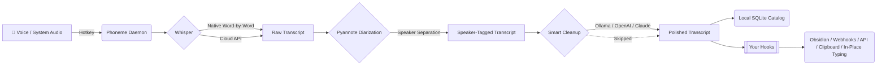

# Phoneme

**Local-first voice notes for Windows. Press a hotkey, speak, release. Get a transcript — your way.**

<p align="center">
  <a href="https://github.com/namefailed/phoneme/actions/workflows/ci.yml"></a>
  <a href="https://github.com/namefailed/phoneme/releases/latest"></a>
  <a href="https://github.com/namefailed/phoneme/releases"></a>
  <a href="LICENSE"></a>
</p>

<p align="center">
  
</p>

> [!TIP]
> **New to Phoneme?** Try the **Smart System Optimizer Wizard**! When you first launch Phoneme, an intuitive setup wizard auto-detects your system RAM and VRAM to recommend the absolute best local models for your hardware. You'll be picking your theme, setting your global hotkeys, and downloading your Whisper & Diarization models in less than 60 seconds.

## 📖 Table of Contents
- [What is Phoneme?](#-what-is-phoneme)
- [How It Works](#-how-it-works)
- [Features](#-features)
- [Install & Requirements](#-install)
- [Why "local-first"?](#-why-local-first)
- [Alternatives & Similar Projects](#-alternatives--similar-projects)
- [Hooks & Integrations](#-hooks)
- [Building from source](#-building-from-source)

## ✨ What is Phoneme?

Phoneme bridges the gap between quick voice dictation and your personal knowledge management systems. It is designed for power users who want the friction-free experience of hitting a hotkey to capture a thought, but without the privacy concerns, subscription fees, or cloud lock-in of modern AI tools.

By default, everything runs **100% locally** on your machine.

When you press your global hotkey (e.g., `Ctrl+Alt+Space`), Phoneme records your voice. When you stop, it leverages a local [Whisper](https://github.com/ggerganov/whisper.cpp) instance to transcribe your speech into text. Finally, it pipes that text through **your own scripts (hooks)** or into an LLM (like Ollama) for cleanup, formatting, or translation.

The app does not force you into a specific ecosystem. It transcribes. You decide where it goes.

## ⚙️ How It Works

Phoneme uses a decoupled, pipeline-driven architecture. 



## 🚀 Features

Phoneme is packed with power-user tools out of the box.

### 🎙️ Advanced Audio & Transcription
- **Apple-Esque Native Word-by-Word Streaming** — Built directly into Phoneme's core. See your words appear on screen in real-time with sub-500ms latency. No HTTP/Disk I/O bottlenecks.
- **In-Place Transcription** — Bind a special global hotkey to directly type your voice transcripts into whatever text box or application you currently have focused (via simulated keystrokes).
- **Offline Speaker Diarization** — Record a meeting and let Phoneme's built-in Pyannote ONNX integration automatically separate the speakers (e.g. `[Speaker 1]: Hello!`). Fully offline, completely private.
- **Meeting Mode (Dual-Track)** — Capture your microphone *and* system audio at the same time as two linked tracks. You get both sides of a call, merged into a beautiful conversation view.
- **Multi-provider Transcription** — Use the bundled, fully-offline native Whisper engine, or plug in OpenAI, Groq, Deepgram, or AssemblyAI if you prefer cloud speed.

### 🧠 Intelligence & Search
- **Local Semantic Search** — Search your recordings by *meaning*, not just keywords. Uses a bundled ONNX embedding model (all-MiniLM-L6-v2) and a local vector index — fully offline.
- **Smart Cleanup (LLM Post-Processing)** — Pipe your transcripts through a local LLM (Ollama) or cloud providers (Anthropic Claude, Groq, OpenAI) to clean up stutters, extract action items, or translate languages. Includes a guided setup wizard and preset prompts.
- **Hardware-Aware Model Manager** — Browse, download, and switch GGML model sizes directly in-app. Phoneme detects your RAM/VRAM and handles all the downloads for you.

### 💻 UI & Polish
- **11 Curated Themes** — System Default, Light, Dark, Catppuccin, Dracula, Everforest, Gruvbox, Nord, One Dark, Rosé Pine, Tokyo Night, and more.
- **Lit Web Components** — A buttery smooth, declarative UI powered by Lit.
- **Transcript Editor with Vim Mode** — Edit transcripts in-app. Power users can toggle full Vim bindings (visual, linewise, and mouse selection).
- **Session Grouping & Indentation** — Meeting tracks are cleanly grouped and indented so you can easily distinguish standalone notes from dual-track meetings.

### 🪝 Extensibility
- **Hook Pipeline** — Deliver every transcript as JSON on stdin to your own scripts. Chain commands, POST to webhooks, or trigger scripts conditionally based on keyword matching (e.g. "action item:").
- **CLI-First** — Every GUI action is a CLI command (`phoneme record --start`). Bind it to AutoHotkey, Stream Deck, or Kanata.

> [!IMPORTANT]  
> See [docs/hooks.md](docs/hooks.md) for a deep dive into writing your own hooks.

## 📦 Install

Download the latest `.msi` from the [releases page](/namefailed/phoneme/releases/latest) and run it.

On first launch, the wizard walks you through:
1. Detecting your hardware and recommending the best setup.
2. Downloading your chosen Whisper & Diarization models.
3. Setting your global hotkey and In-Place Transcription hotkey.
4. Choosing your aesthetic theme.

## 🔒 Why "local-first"?

**Local-first, not local-only.** No telemetry, no update pings — ever. By default the only network calls Phoneme makes are to your own whisper-server endpoint, your chosen local LLM, and (optionally) Hugging Face when you explicitly click to download a model. If you deliberately switch transcription to a cloud provider, Phoneme warns you up front. Local is the default and the recommended path.

## 🆚 Alternatives & Similar Projects

Phoneme isn't for everyone, and that's fine. If one of these fits your needs better, use it:

- **[Wispr Flow](https://wisprflow.ai/)** — Highly polished, commercial, cloud-based. Types directly into your focused app.
- **[MacWhisper](https://goodsnooze.gumroad.com/l/macwhisper)** & **[Superwhisper](https://superwhisper.com/)** — Excellent local dictation for **macOS**.
- **[AudioPen](https://audiopen.ai/)** — Cloud web app that beautifully summarizes rambling thoughts.

**Reach for Phoneme** when you want it local-first, open-source, Windows-native, and scriptable.

## 💻 CLI is a peer, not a fallback

Every action available in the GUI is available from the command line. See the fully detailed [CLI Reference](docs/cli_reference.md) for all arguments and flags.

## 🪝 Hooks

A hook is your script. Phoneme invokes it with the transcript as JSON on stdin. Ship your own or start from one of the **nine** reference hooks. See [docs/hooks.md](docs/hooks.md) for the full contract and worked examples.

## 🏗️ Architecture

See [docs/architecture.md](docs/architecture.md) for the design and [docs/INTERNAL.md](docs/INTERNAL.md) for a contributor's deep dive.

## 🛠️ Building from source

```bash
# Requirements: Rust 1.75+, Node 20+, pnpm 9+, tauri-cli 2

cd frontend && pnpm install && cd ..
cargo install tauri-cli --version "^2.0" --locked
cargo tauri build
```

## 🤝 Contributing

We welcome contributions! See our [Contributing Guide](CONTRIBUTING.md) and [Start a discussion](https://github.com/namefailed/phoneme/discussions).

## 📄 License

MIT OR Apache-2.0.

---

Phoneme is built by [@namefailed](https://github.com/namefailed). It is not a commercial product, has no telemetry, and never will.
