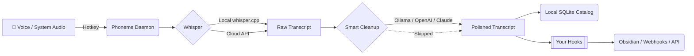

# Phoneme

**Local-first voice notes for Windows. Press a hotkey, speak, release. Get a transcript — your way.**

<p align="center">
  <a href="https://github.com/namefailed/phoneme/actions/workflows/ci.yml"></a>
  <a href="https://github.com/namefailed/phoneme/releases/latest"></a>
  <a href="https://github.com/namefailed/phoneme/releases"></a>
  <a href="LICENSE"></a>
</p>

<p align="center">
  
</p>

> [!TIP]
> **New to Phoneme?** Try the **First Run Wizard**! When you first launch Phoneme, an intuitive setup wizard guides you through selecting your microphone, configuring your local Whisper models, picking an aesthetic theme, and setting up your global hotkeys. You'll be up and running in less than 60 seconds.

## 📖 Table of Contents
- [What is Phoneme?](#-what-is-phoneme)
- [How It Works](#-how-it-works)
- [Features](#-features)
- [Install & Requirements](#-install)
- [Why "local-first"?](#-why-local-first)
- [Alternatives & Similar Projects](#-alternatives--similar-projects)
- [Hooks & Integrations](#-hooks)
- [Building from source](#-building-from-source)

## ✨ What is Phoneme?

Phoneme bridges the gap between quick voice dictation and your personal knowledge management systems. It is designed for power users who want the friction-free experience of hitting a hotkey to capture a thought, but without the privacy concerns, subscription fees, or cloud lock-in of modern AI tools.

By default, everything runs **100% locally** on your machine.

When you press your global hotkey (e.g., `Ctrl+Alt+Space`), Phoneme records your voice. When you stop, it leverages a local [Whisper](https://github.com/ggerganov/whisper.cpp) instance to transcribe your speech into text. Finally, it pipes that text through **your own scripts (hooks)** or into an LLM (like Ollama) for cleanup, formatting, or translation.

The app does not force you into a specific ecosystem. It transcribes. You decide where it goes.

## ⚙️ How It Works

Phoneme uses a decoupled, pipeline-driven architecture. 



## 🚀 Features

Phoneme is packed with power-user tools out of the box.

### 🧠 Intelligence & Search
- **Local Semantic Search** — Search your recordings by *meaning*, not just keywords. Uses a bundled ONNX embedding model (all-MiniLM-L6-v2) and a local vector index — fully offline.
- **Smart Cleanup (LLM Post-Processing)** — Pipe your transcripts through a local LLM (Ollama) or cloud providers (Anthropic Claude, Groq, OpenAI) to clean up stutters, extract action items, or translate languages. Includes a guided setup wizard and preset prompts.
- **Multi-provider Transcription** — Use the bundled, fully-offline [whisper-server][whisper-server], or plug in OpenAI, Groq, Deepgram, or AssemblyAI if you prefer cloud speed.
- **Whisper Model Manager** — Browse, download, and switch GGML model sizes directly in-app, complete with hardware-aware recommendations.

### 🎙️ Capture & Audio
- **Meeting Mode (Dual-Track)** — Capture your microphone *and* system audio at the same time as two linked tracks. You get both sides of a call, merged into a beautiful conversation view.
- **System-Audio Capture** — Record what's playing through your speakers (WASAPI loopback).
- **Pre-roll Buffer** — Keeps a rolling buffer of a few hundred milliseconds before you hit record, so your first syllable is never clipped.
- **Pause / Resume** — Pause mid-recording and resume into the same file.
- **Import Audio** — Drop an existing `.wav`, `.mp3`, or `.m4a` file into the catalog to run it through the same transcription pipeline.

### 💻 UI & Polish
- **Lit Web Components** — A buttery smooth, declarative UI powered by Lit.
- **Paginated Recordings List** — Infinite-scroll through thousands of recordings without UI lag.
- **Transcript Editor with Vim Mode** — Edit transcripts in-app. Power users can toggle full Vim bindings (visual, linewise, and mouse selection).
- **11 Curated Themes** — Catppuccin, Dracula, Everforest, Gruvbox, Nord, One Dark, Rosé Pine, Tokyo Night, and more.
- **Session Grouping & Indentation** — Meeting tracks are cleanly grouped and indented so you can easily distinguish standalone notes from dual-track meetings.

### 🪝 Extensibility
- **Hook Pipeline** — Deliver every transcript as JSON on stdin to your own scripts. Chain commands, POST to webhooks, or trigger scripts conditionally based on keyword matching (e.g. "action item:").
- **CLI-First** — Every GUI action is a CLI command (`phoneme record --start`). Bind it to AutoHotkey, Stream Deck, or Kanata.
- **Config Profiles** — Save named configuration profiles (e.g., Work vs. Personal) and switch instantly from the system tray.

> [!IMPORTANT]  
> See [docs/hooks.md](docs/hooks.md) for a deep dive into writing your own hooks.

## 📦 Install

Download the latest `.msi` from the [releases page](/namefailed/phoneme/releases/latest) and run it.

On first launch, the wizard walks you through:
1. Pointing at your whisper-server (or using the bundled one with your GGUF model)
2. Picking your microphone
3. Picking your hook script (default writes to stdout)
4. Setting your global hotkey
5. Choosing your aesthetic theme

**Requirements:** Windows 10/11. A locally running [whisper-server][whisper-server] (installed alongside Phoneme in bundled mode). For bundled mode, you also bring your own GGUF model file.

## 🔒 Why "local-first"?

**Local-first, not local-only.** No telemetry, no update pings — ever. By default the only network calls Phoneme makes are to your own whisper-server endpoint, your chosen local LLM, and (optionally) Hugging Face when you explicitly click to download a model. If you deliberately switch transcription to a cloud provider, Phoneme warns you up front. Local is the default and the recommended path.

## 🆚 Alternatives & Similar Projects

Phoneme isn't for everyone, and that's fine. If one of these fits your needs better, use it:

- **[Wispr Flow](https://wisprflow.ai/)** — Highly polished, commercial, cloud-based. Types directly into your focused app.
- **[MacWhisper](https://goodsnooze.gumroad.com/l/macwhisper)** & **[Superwhisper](https://superwhisper.com/)** — Excellent local dictation for **macOS**.
- **[AudioPen](https://audiopen.ai/)** — Cloud web app that beautifully summarizes rambling thoughts.

**Reach for Phoneme** when you want it local-first, open-source, Windows-native, and scriptable.

## 💻 CLI is a peer, not a fallback

Every action available in the GUI is available from the command line:

```bash
phoneme record --oneshot                        # record + transcribe + print
phoneme record --start                          # non-blocking start
phoneme record --stop                           # non-blocking stop
phoneme list --since 2026-05-19                 # query the catalog
phoneme show 20260519T143500823                 # one recording's details
phoneme export backup.zip                       # bulk export audio and metadata
phoneme doctor                                  # health check
phoneme config reload                           # hot reload config from disk
phoneme watch                                   # subscribe to events as JSON
```

## 🪝 Hooks

A hook is your script. Phoneme invokes it with the transcript as JSON on stdin. Ship your own or start from one of the **nine** reference hooks:

| Hook | What it does |
|---|---|
| `to-stdout.ps1` | Default. Echoes the transcript to stdout. |
| `to-clipboard.ps1` | Copies the transcript to the Windows clipboard. |
| `to-file.ps1` | Appends every note to one running Markdown file. |
| `to-markdown-daily.ps1` | Appends to a daily note (Obsidian-style). |
| `to-webhook.ps1` | POSTs the transcript to Discord/Slack/any webhook. |
| `summarize-with-ollama.ps1` | Local-LLM summary + action items, fully offline. |
| `to-todoist.ps1` | Turns an "action item:" note into a Todoist task. |

See [docs/hooks.md](docs/hooks.md) for the full contract and worked examples.

## 🏗️ Architecture

See [docs/architecture.md](docs/architecture.md) for the design and [docs/INTERNAL.md](docs/INTERNAL.md) for a contributor's deep dive.

## 🛠️ Building from source

```bash
# Requirements: Rust 1.75+, Node 20+, pnpm 9+, tauri-cli 2

cd frontend && pnpm install && cd ..
cargo install tauri-cli --version "^2.0" --locked
cargo tauri build
```

## 🗺️ Roadmap

For a detailed look at upcoming features, see the [Roadmap](docs/ROADMAP.md).

## 🤝 Contributing

We welcome contributions! See our [Contributing Guide](CONTRIBUTING.md) and [Start a discussion](https://github.com/namefailed/phoneme/discussions).

## 📄 License

MIT OR Apache-2.0.

---

Phoneme is built by [@namefailed](https://github.com/namefailed). It is not a commercial product, has no telemetry, and never will.

[whisper-server]: https://github.com/ggerganov/whisper.cpp
[whisper-models]: https://huggingface.co/ggerganov/whisper.cpp/tree/main
