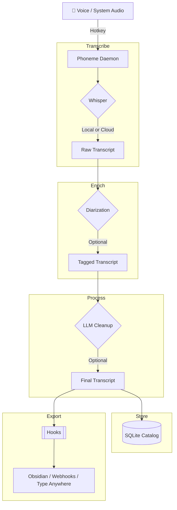

<p align="center">
  
</p>

<p align="center">
  <a href="https://github.com/namefailed/phoneme/actions"></a>
  <a href="https://github.com/namefailed/phoneme/releases"></a>
  <a href="LICENSE"></a>
</p>

# 🎙️ Phoneme

**Local-first voice transcription for power users.**

Hit a hotkey. Speak. Get text anywhere.

Phoneme runs **100% offline** by default. No cloud required, no subscriptions, no telemetry.

---

## 🧠 Philosophy

| Principle | What It Means |
|-----------|---------------|
| **🔒 Privacy First** | Voice never leaves your machine. No forced updates, no tracking. |
| **⚡ Flexible** | Local Whisper for privacy, or cloud APIs (OpenAI/Groq) for speed. Your choice. |
| **🔌 Extensible** | JSON output → your scripts. Obsidian, Notion, Jira, Discord, Python—wherever you want. |

## ⚙️ How It Works

Phoneme uses a decoupled, pipeline-driven architecture. 



## ✨ Core Features

- **👥 Meeting Mode (Dual-Track Capture)**: Instantly capture both your microphone and your computer's audio. Let Phoneme separate the tracks and apply local Pyannote **Speaker Diarization** to build a perfect chronological transcript of any Zoom, Teams, or Google Meet call.
- **⌨️ Transcribe-in-Place (`Ctrl+Alt+I`)**: Press a global hotkey to speak, and Phoneme will use OS-level keystroke simulation to instantly type your dictated words into any active application (Word, Slack, Chrome, VSCode).
- **✨ Smart Cleanup**: Pipe your raw transcripts through a Large Language Model (locally via Ollama, or via the cloud) to automatically fix stutters, translate languages, or generate perfect meeting summaries.
- **🔍 Lightning Fast Semantic Search**: Easily manage 10,000+ recordings instantly using SQLite's FTS5 Full-Text Search, or search by *meaning* using our offline ONNX semantic embedding index.
- **💻 CLI is a Peer**: Every GUI action is a CLI command (`phoneme record --start`). Bind it to AutoHotkey, Stream Deck, or Kanata.

---

## 🆚 Alternatives & Similar Projects

Phoneme isn't for everyone, and that's fine. If one of these fits your needs better, use it:

- **[Wispr Flow](https://wisprflow.ai/)** — Highly polished, commercial, cloud-based. Types directly into your focused app.
- **[MacWhisper](https://goodsnooze.gumroad.com/l/macwhisper)** & **[Superwhisper](https://superwhisper.com/)** — Excellent local dictation for **macOS**.
- **[AudioPen](https://audiopen.ai/)** — Cloud web app that beautifully summarizes rambling thoughts.

**Reach for Phoneme** when you want it local-first, open-source, Windows-native, and endlessly scriptable.

---

## 📚 Supreme Documentation

We believe that exceptional software requires exceptional documentation. Whether you're an end-user learning the ropes or a developer looking to integrate via our named pipes, everything you need is here.

### For Users (Using Phoneme)
- **[Getting Started](docs/user-guide/getting_started.md)**: A walkthrough of the hardware-aware First Run Wizard.
- **[Meeting Mode & Dual-Track](docs/user-guide/meeting_mode.md)**: How to capture and separate multi-speaker calls.
- **[Transcribe-in-Place](docs/user-guide/transcribe_in_place.md)**: Use Phoneme as a system-wide dictation engine.
- **[Diarization & Whisper](docs/user-guide/diarization_and_whisper.md)**: How local Pyannote speaker tagging works.
- **[Smart Cleanup (LLM Integration)](docs/user-guide/smart_cleanup.md)**: Using AI to polish, format, and translate your transcripts.
- **[Search & Organization](docs/user-guide/search_and_organization.md)**: Mastering Tags and Full-Text Search.
- **[Config Profiles](docs/user-guide/config_profiles.md)**: Snapshots for multiple environments.
- **[Importing Audio](docs/user-guide/importing_audio.md)**: Process pre-recorded files through the pipeline.
- **[Exporting & Backup](docs/user-guide/exporting_and_backup.md)**: Taking your data with you.
- **[Troubleshooting & FAQ](docs/user-guide/troubleshooting.md)**

### For Developers (Building on Phoneme)
- **[Plugins and Hooks Ecosystem](docs/developer-guide/plugins_and_hooks.md)**: How to write scripts to receive Phoneme data, and our vision for the Plugin Marketplace.
- **[IPC Integration Guide](docs/developer-guide/ipc_integration.md)**: Build advanced automation by communicating directly with the `\\.\pipe\phoneme-daemon` named pipe via Node.js, Python, or AutoHotkey.
- **[Architecture & Internals](docs/developer-guide/internals.md)**: A deep-dive into the async task topology, `cpal` audio routing, and SQLite catalog.
- **[CLI Reference](docs/developer-guide/cli_reference.md)**: Full command-line automation guide.
- **[Building from Source](docs/developer-guide/building_from_source.md)**: Compiling the Rust and Tauri stack from scratch.

---

## 🚀 Quick Start

Download the latest MSI from the [Releases](https://github.com/namefailed/phoneme/releases) page. The included First Run Wizard will detect your hardware and configure the optimal Whisper model automatically!

```bash
# Power users can bypass the UI entirely and use the CLI:
phoneme record --start
phoneme record --stop
phoneme list
```

## 📄 License

MIT OR Apache-2.0.

Phoneme is built by [@namefailed](https://github.com/namefailed). It is not a commercial product, has no telemetry, and never will.
