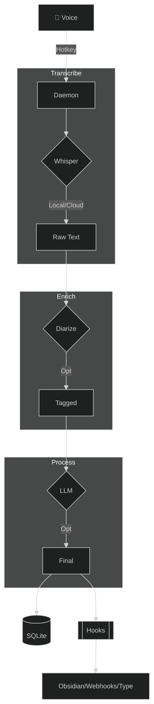

<p align="center">
  
</p>

<p align="center">
  <a href="https://github.com/namefailed/phoneme/actions"></a>
  <a href="https://github.com/namefailed/phoneme/releases"></a>
  <a href="LICENSE"></a>
</p>

# 🎙️ Phoneme

**Local-first voice transcription for power users.**

Hit a hotkey. Speak. Get text anywhere.

Phoneme runs **100% offline** by default. No cloud required, no subscriptions, no telemetry.

---

## 🧠 Philosophy

| Principle | What It Means |
|-----------|---------------|
| **🔒 Privacy First** | Voice never leaves your machine. No forced updates, no tracking. |
| **⚡ Flexible** | Local Whisper + Ollama for privacy, or cloud APIs (OpenAI, Anthropic, Groq, Gemini, Deepgram, and more) for speed. Each step picks its own provider. |
| **🔌 Extensible** | JSON output → your scripts. Obsidian, Notion, Jira, Discord, Python—wherever you want. |

## 🎯 Why Voice?

You think faster than you type. The average person speaks at **150 words per minute** but types at only **40**. That gap is where ideas die.

**Capture thoughts before they evaporate.** Voice lets you seize ideas in their natural habitat—while walking, showering, driving, cooking. No app to open, no cursor to find. Just hit a hotkey and think out loud.

**Speak to AI like a human.** When you dictate a prompt, you give cleaner context—natural pauses, emphasis, clarifications that you'd never type out. The models understand *you* better when you sound like yourself.

**Accessibility is for everyone.** RSI, carpal tunnel, vision strain, dyslexia, tremors—typing isn't universal. Voice removes barriers. But even without disabilities, your wrists will thank you after your 10,000th daily keystroke.

**No punctuation, no spelling, no backspace.** Just pure thought flow. The AI cleans it up. You focus on *what* to say, not how to format it.

**Multitasking is real.** Record a meeting while taking notes. Capture a shower thought while soaping. Dictate a bug fix while compiling. Voice doesn't steal your eyes or hands from the task at hand.

**Mobile-first life.** Your phone is always there. Typing on glass at 20 WPM isn't. Voice makes your pocket computer actually useful for more than consumption.

---

## ⚙️ How It Works

Phoneme uses a decoupled, pipeline-driven architecture. 



## ✨ Core Features

- **🎙️ Local transcription by default**: A bundled `whisper.cpp` server runs on your machine — audio never leaves your PC. The First Run Wizard detects your RAM/VRAM and picks the right model.
- **🔌 Bring-your-own provider**: Transcription, live preview, cleanup, summary, auto-title, and auto-tags each pick their own provider+model **independently**. Local whisper.cpp/Ollama for privacy, or cloud APIs (OpenAI, Anthropic, Groq, Gemini, Deepgram, AssemblyAI, ElevenLabs, and many more) for speed. One-click presets, live model lists.
- **👥 Meeting Mode (Dual-Track Capture)**: Capture both your microphone and your computer's audio as two linked tracks sharing a wall-clock timeline, merged into one chronological transcript. Optional **speaker diarization** (offline ONNX, or cloud) labels who spoke on any Zoom, Teams, or Meet call.
- **⌨️ Transcribe-in-Place (`Ctrl+Alt+I`)**: Speak with a global hotkey and Phoneme types (or pastes) your dictated words into the focused application (Word, Slack, Chrome, VS Code). A zero-latency fast lane skips the queue entirely so text lands the moment you stop talking.
- **✨ Smart Cleanup, AI Summary & Auto-Titles**: Pipe raw transcripts through an LLM to fix stutters, reformat, or translate — and optionally generate a per-recording summary, on demand or automatically. Every recording gets a readable auto-title (a free heuristic, or an optional LLM title). Three transcript layers (raw → cleaned → edited) are kept so nothing is lost.
- **🔍 Keyword + Semantic Search**: Manage thousands of recordings with SQLite FTS5 full-text search, or search by *meaning* with an offline, **chunked hybrid** index — per-passage ONNX embeddings fused with keyword ranking (RRF), cached in memory for fast recall, so a query finds the recording whether you remember the gist or the one distinctive word. **More-like-this** finds a recording's neighbours from its stored vectors (no re-embedding). Bring your own embedding model.
- **🏷️ Organize at scale**: Tags with a full manager, ⭐ favorites, saved searches that snapshot every filter, AI **auto-tag suggestions** you approve before they apply, and a side-by-side view for any two transcripts.
- **📤 Import & export anything**: Import `.wav` / `.mp3` / `.m4a` / `.flac` straight into the pipeline; export the whole library as a portable zip, or any recording as **SRT / WebVTT captions**.
- **⌨️ Keyboard everything**: Opt-in vim-style navigation drives all three panes (and the queue) — the detail pane is a 2D grid you walk with `h`/`j`/`k`/`l`, the waveform has an Enter-to-scrub mode (`h`/`l` ±1s, Space to play), `g`-chords jump anywhere, the list zooms with `Ctrl+=`/`-`, and `?` shows the full cheat sheet.
- **🩺 Provider-aware Self-healing**: A header health pill + Doctor watch the local servers and follow the *effective* connection each feature uses (cloud keys included); one click (or `phoneme doctor --fix`) sweeps a hung/orphaned whisper-server and respawns it from config.
- **♻️ Clean lifecycle**: The daemon owns the work and outlives any window. Quit stops it cleanly (finalizing an in-flight take, killing its whisper/Ollama children) — or leave it running headless. A Phoneme-launched Ollama is started on demand and never touches an Ollama you already had running.
- **💻 CLI is a Peer**: Every GUI action is a CLI command (`phoneme record start`). Bind it to AutoHotkey, Stream Deck, or Kanata.

---

## 🆚 Alternatives & Similar Projects

Phoneme isn't for everyone, and that's fine. If one of these fits your needs better, use it:

- **[Wispr Flow](https://wisprflow.ai/)** — Highly polished, commercial, cloud-based. Types directly into your focused app.
- **[MacWhisper](https://goodsnooze.gumroad.com/l/macwhisper)** & **[Superwhisper](https://superwhisper.com/)** — Excellent local dictation for **macOS**.
- **[AudioPen](https://audiopen.ai/)** — Cloud web app that beautifully summarizes rambling thoughts.

**Reach for Phoneme** when you want it local-first, open-source, Windows-native, and endlessly scriptable.

---

## 📚 Documentation

**[Full documentation index →](docs/README.md)**

### Users
| Guide | Topic |
|-------|--------|
| [Getting Started](docs/user-guide/getting_started.md) | Install, wizard, first recording |
| [Providers & Models](docs/user-guide/providers_and_models.md) | Pick STT/LLM providers, keys, local vs cloud |
| [Meeting Mode](docs/user-guide/meeting_mode.md) | Dual-track capture + wall-clock sync |
| [Hotkeys & Recording Modes](docs/user-guide/hotkeys_and_recording_modes.md) | Hold, toggle, CLI bindings |
| [Settings Overview](docs/user-guide/settings_overview.md) | Every settings screen (with screenshots) |
| [Smart Cleanup & Summary](docs/user-guide/smart_cleanup.md) | LLM post-processing + AI summary |
| [Semantic Search & Ask](docs/user-guide/semantic_search.md) | Meaning-based recall + Ask your archive (cited answers) |
| [FAQ](docs/user-guide/faq.md) | Common questions |
| [Troubleshooting](docs/user-guide/troubleshooting.md) | Fixes and diagnostics |

### Developers
| Guide | Topic |
|-------|--------|
| [CONTRIBUTING.md](CONTRIBUTING.md) | Dev setup, IPC workflow, PR checklist |
| [Architecture](docs/developer-guide/architecture.md) | The full journey: three processes, a recording's life, recall path |
| [Internals](docs/developer-guide/internals.md) | Subsystem deep dives: async topology, audio, catalog/search, alignment math |
| [Backend Guide](docs/developer-guide/backend_guide.md) | Rust workspace map, actors, supervision, SQLx/WAL |
| [Config Reference](docs/developer-guide/config_reference.md) | Full `config.toml` schema |
| [IPC Integration](docs/developer-guide/ipc_integration.md) | NDJSON named pipe |
| [CLI Reference](docs/developer-guide/cli_reference.md) | All commands |
| [Testing & CI](docs/developer-guide/testing_and_ci.md) | Local checks matching GitHub Actions |
| [Roadmap](ROADMAP.md) | Planned features & direction |
| [Changelog](CHANGELOG.md) | Shipped releases |

---

## 🚀 Quick Start

Download the latest MSI from the [Releases](https://github.com/namefailed/phoneme/releases) page. The included First Run Wizard will detect your hardware and configure the optimal Whisper model automatically!

```bash
# Power users can bypass the UI entirely and use the CLI:
phoneme record start
phoneme record stop
phoneme list
```

## 📄 License

MIT OR Apache-2.0.

Phoneme is built by [@namefailed](https://github.com/namefailed). It is not a commercial product, has no telemetry, and never will.

## 💖 Support

If you find Phoneme useful, please consider supporting my work:

[](https://ko-fi.com/Q0X520YFU1)
