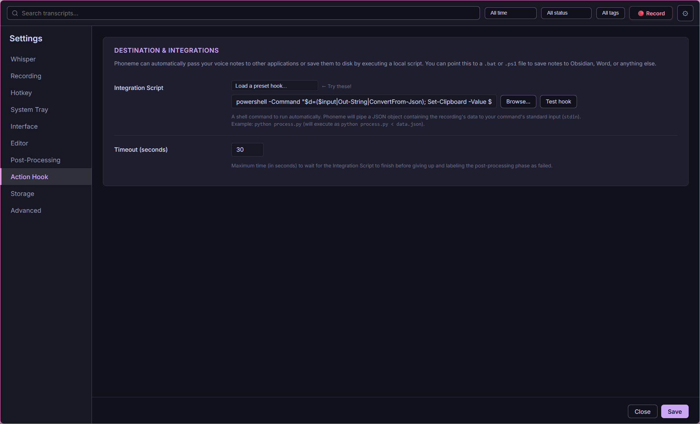

# Phoneme

**Local-first voice notes for Windows. Press a hotkey, speak, release. Get a transcript — your way.**

<p align="center">
  <a href="https://github.com/namefailed/phoneme/actions/workflows/ci.yml"></a>
  <a href="https://github.com/namefailed/phoneme/releases/latest"></a>
  <a href="https://github.com/namefailed/phoneme/releases"></a>
  <a href="LICENSE"></a>
</p>

<p align="center">
  
</p>

<p align="center">
  
</p>

<p align="center">
  
</p>

<p align="center">
  
</p>

<p align="center">
  
</p>

<p align="center">
  
</p>

<p align="center">
  
</p>

<p align="center">
  
</p>

<p align="center">
  
</p>

## ✨ What is Phoneme?

Phoneme bridges the gap between quick voice dictation and your personal knowledge management systems. It is designed for power users who want the friction-free experience of hitting a hotkey to capture a thought, but without the privacy concerns, subscription fees, or cloud lock-in of modern AI tools.

Everything runs **100% locally** on your machine.

When you press your global hotkey (e.g., `Ctrl+Alt+Space`), Phoneme records your voice. When you stop, it leverages a local [Whisper](https://github.com/ggerganov/whisper.cpp) instance to transcribe your speech into text. Finally, it pipes that text through **your own scripts (hooks)** or into an LLM (like Ollama) for cleanup, formatting, or translation.

The app does not force you into a specific ecosystem. It transcribes. You decide where it goes.

## 🚀 What's in v1.3.0

This is the stable public release. Everything in this list is available today:

- **Press-to-talk & toggle modes** — bind any global hotkey, choose Hold or Toggle behaviour.
- **Local Whisper transcription** — uses your own [whisper-server][whisper-server] or the bundled one; your audio never leaves your machine.
- **AI post-processing** — optionally clean up, format, or translate transcripts through a local [Ollama](https://ollama.ai) model or OpenAI. Includes 9 preset prompts.
- **Hook pipeline** — every transcript is delivered to your script as JSON on stdin. Chain scripts, POST to webhooks, send to Obsidian, Org-mode, Notion, or anywhere. Five reference hooks included.
- **Full CLI** — every GUI action is also available as `phoneme` commands. Works with AutoHotkey, Kanata, Stream Deck, or any hotkey daemon.
- **Tags** — attach colour-coded tags to recordings; filter and search the catalog.
- **Transcript editor** — edit transcripts in-app with optional full Vim mode (visual, linewise, mouse selection all work).
- **Doctor** — built-in health checker that tests the daemon, audio dir, hooks, Whisper server, and Ollama, with one-click fixes.
- **11 themes** — Catppuccin Mocha/Macchiato/Latte, Dracula, Everforest, Gruvbox, Nord, One Dark, Rosé Pine, Solarized Light, Tokyo Night.
- **Auto-updater** — downloads and installs new releases directly from GitHub.
- **Export** — bulk export all recordings and metadata as a zip archive.

## 📦 Install

Download the latest `.msi` from the [releases page](/namefailed/phoneme/releases/latest) and run it.

On first launch, the wizard walks you through:
- Pointing at your whisper-server (or using the bundled one with your GGUF model)
- Picking your microphone
- Picking your hook script (default writes to stdout)
- Setting your global hotkey
- Choosing your aesthetic theme

**Requirements:** Windows 10/11. A locally running [whisper-server][whisper-server] (installed alongside Phoneme in bundled mode, or run separately in external mode). For bundled mode, you also bring your own GGUF model file (e.g., [ggml-base.en.bin][whisper-models]).

## 🔒 Why "local-first"?

No cloud. No telemetry. No update pings. The only network calls Phoneme makes are to your configured whisper-server endpoint, your chosen local LLM, and (optionally) Hugging Face when you explicitly click to download a model during setup. Your voice and your thoughts stay on your hard drive.

## 🤝 Other Projects That Pair Well With Phoneme

Because Phoneme pipes JSON directly into your own scripts (`hooks`), it pairs perfectly with local-first, text-based productivity apps:
- **Obsidian:** Write a hook that automatically appends your transcript to your daily note.
- **Logseq / Roam Research:** Format your transcript as a bullet point and append it to your journal file.
- **Emacs (Org-Mode):** Pipe the output directly into `org-capture`.
- **Notion:** Use a Python or PowerShell script to POST the JSON payload to the Notion API.

## 🔄 Alternatives & Similar Projects

If Phoneme doesn't quite fit your workflow, or if you're on a different operating system, check out these excellent alternatives:
- **[MacWhisper](https://goodsnooze.gumroad.com/l/macwhisper)** & **[Superwhisper](https://superwhisper.com/)**: Fantastic, highly polished local dictation apps built exclusively for macOS.
- **[AudioPen](https://audiopen.ai/)**: A popular cloud-based web app that records and beautifully summarizes your thoughts.
- **[AquaVoice](https://withaqua.com/)**: A voice-native text editor.

## 💻 CLI is a peer, not a fallback

Every action available in the GUI is available from the command line:

```bash
phoneme record --oneshot                        # record + transcribe + print
phoneme record --start                          # non-blocking start
phoneme record --stop                           # non-blocking stop
phoneme list --since 2026-05-19                 # query the catalog
phoneme show 20260519T143500823                 # one recording's details
phoneme export backup.zip                       # bulk export audio and metadata
phoneme doctor                                  # health check
phoneme config reload                           # hot reload config from disk
phoneme watch                                   # subscribe to events as JSON
```

### Bring Your Own Hotkey Daemon (BYOHD)

We deliberately built Phoneme with a CLI-first architecture to provide you with the exact flexibility that big tech products won't. You aren't locked into our built-in global hotkeys. Advanced users can bind `phoneme` CLI commands to any hotkey daemon, window manager, or macro pad they prefer—whether that's AutoHotkey, Kanata, WHKD, or a Stream Deck. 

Because the CLI seamlessly controls the daemon, setting up a custom workflow is as simple as making your tool shell out to `phoneme record --start` and `phoneme record --stop`!

## 🪝 Hooks

A hook is your script. Phoneme invokes it with the transcript as JSON on stdin. Ship your own or use one of the four reference hooks:

| Hook | What it does |
|---|---|
| `to-stdout.ps1` | Default. Echoes the transcript to stdout. |
| `to-clipboard.ps1` | Copies the transcript to the Windows clipboard instantly. |
| `to-org-journal.ps1` | Appends to `~/Documents/org/journal.org` (Doom Emacs / Denote). |
| `to-markdown-daily.ps1` | Appends to `~/Documents/notes/YYYY-MM-DD.md` (Obsidian-style). |
| `to-denote.ps1` | Creates a Denote-flavored note file under `~/Documents/org/notes/`. |

Chain multiple hooks under `[hook] commands = ["script1.ps1", "script2.bat"]`, and optionally POST the JSON payload to a `webhook_url` simultaneously.

See [docs/hooks.md](docs/hooks.md) for the full contract.

## 🏗️ Architecture

Three binaries, three libraries, one workspace:

```text
                            ┌──────────────────────────────────┐
                            │          phoneme-daemon          │
                            │ (Headless: audio, queue, catalog)│
                            └───────────────▲──────────────────┘
                                            │
                      named pipe (\\.\pipe\phoneme-daemon)
                                            │
             ┌──────────────────────────────┴──────────────────────────────┐
             │                                                             │
             ▼                                                             ▼
    ┌─────────────────┐                                           ┌─────────────────┐
    │     phoneme     │                                           │  phoneme-tray   │
    │      (CLI)      │                                           │   (Tauri GUI)   │
    └─────────────────┘                                           └─────────────────┘
```

## 🛠️ Building from source

```bash
# Requirements: Rust 1.75+, Node 20+, pnpm 9+, tauri-cli 2

cd frontend && pnpm install && cd ..
cargo install tauri-cli --version "^2.0" --locked
cargo tauri build
```

The MSI lands at `target/release/bundle/msi/`.

For development (with hot reload):

```bash
# Terminal A
cargo run -p phoneme-daemon -- --foreground

# Terminal B
cargo tauri dev
```

## 🗺️ Roadmap

For a detailed look at our upcoming features—including macOS/Linux ports, Streaming Transcription, and Bundled Ollama—please see our [Roadmap](docs/ROADMAP.md).

## 🤝 Contributing

We welcome contributions! If you're interested in helping improve Phoneme, please check out our [Contributing Guide](CONTRIBUTING.md) to learn how to set up the development environment, build the app, and submit pull requests.

Have a question or idea? [Start a discussion](https://github.com/namefailed/phoneme/discussions).

## 📄 License

MIT OR Apache-2.0.

---

Phoneme is built by [@namefailed](https://github.com/namefailed). It is not a commercial product, has no telemetry, and never will.

[whisper-server]: https://github.com/ggerganov/whisper.cpp
[whisper-models]: https://huggingface.co/ggerganov/whisper.cpp/tree/main
