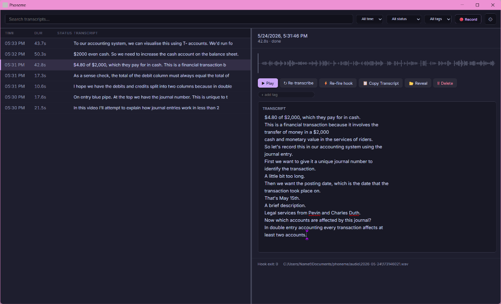

# Phoneme

Local-first voice notes for Windows. Press a hotkey, speak, release. Get a
transcript — your way.

<p align="center">
  
</p>

## What it does

1. You press a hotkey (or run `phoneme record --oneshot`).
2. Phoneme records audio from your microphone.
3. A local Whisper transcribes it (no cloud).
4. The transcript becomes JSON, piped to **your script** — append to a journal,
   create a Denote note, post to a webhook, whatever.

The app does not touch your journal. It transcribes. You decide where it goes.

## Install

Download the latest `.msi` from the [releases page](../../releases) and run it.

On first launch the wizard walks you through:
- Pointing at your whisper-server (or using the bundled one with your GGUF)
- Picking your microphone
- Picking your hook script (default writes to stdout)
- Optional global hotkey

Requirements: Windows 10/11. A locally running [whisper-server][whisper-server]
(installed alongside Phoneme in bundled mode, or run separately in external
mode). For bundled mode you also bring your own GGUF model file (e.g.,
[Gemma-4-E4B][gemma]).

## Why "local-first"

No cloud. No telemetry. No update pings. The only network calls Phoneme makes
are to your configured whisper-server endpoint and, optionally and only when
you click it, Hugging Face (during the v1.1 download-model wizard).

## CLI is a peer, not a fallback

Every action available in the GUI is available from the command line:

```bash
phoneme record --oneshot                        # record + transcribe + print
phoneme record --start                          # non-blocking start
phoneme record --stop                           # non-blocking stop
phoneme list --since 2026-05-19                 # query the catalog
phoneme show 20260519T143500823                 # one recording's details
phoneme export backup.zip                       # bulk export audio and metadata
phoneme doctor                                  # health check
phoneme config reload                           # hot reload config from disk
phoneme watch                                   # subscribe to events as JSON
```

This is what makes external hotkey daemons work — Kanata, AHK, WHKD all just
shell out to `phoneme record --start/--stop`.

## Hooks

A hook is your script. Phoneme invokes it with the transcript as JSON on
stdin. Ship your own or use one of the four reference hooks:

| Hook | What it does |
|---|---|
| `to-stdout.ps1` | Default. Echoes the transcript. |
| `to-org-journal.ps1` | Appends to `~/Documents/org/journal.org`. |
| `to-markdown-daily.ps1` | Appends to `~/Documents/notes/YYYY-MM-DD.md`. |
| `to-denote.ps1` | Creates a Denote-flavored note file. |

You can chain multiple hooks in `config.toml` under `[hook] commands = ["script1.ps1", "script2.bat"]`, and optionally post the JSON payload to a `webhook_url` at the end of the pipeline.

See [docs/hooks.md](docs/hooks.md) for the full contract.

## Architecture

Three binaries, three libraries, one workspace:

```
phoneme-daemon      headless brain (audio + queue + catalog + Whisper lifecycle)
  ▲    ▲    ▲
  │    │    │  named pipe \\.\pipe\phoneme-daemon
  │    │    └─ Kanata / AHK / external hotkey daemon
  │    └─── phoneme-tray (Tauri GUI + tray)
  └────── phoneme (CLI)
```

## Building from source

```bash
# Requirements: Rust 1.75+, Node 20+, pnpm 9+, tauri-cli 2

cd frontend && pnpm install && cd ..
cargo install tauri-cli --version "^2.0" --locked
cargo tauri build
```

The MSI lands at `src-tauri/target/release/bundle/msi/`.

For development (with hot reload):

```bash
# Terminal A
cargo run -p phoneme-daemon -- --foreground

# Terminal B
cargo tauri dev
```

## Troubleshooting

See [docs/troubleshooting.md](docs/troubleshooting.md).

## Roadmap

- **v1.1** — Windows MSI, single hook delivery, modes 1+2
- **v1.1** *(this release)* — Model download wizard, tags UI, webhook target, chainable hooks, hot reload, bulk export
- **Future** — macOS + Linux ports, mobile thin-client, streaming transcription

## Contributing

We welcome contributions! If you're interested in helping improve Phoneme, please check out our [Contributing Guide](CONTRIBUTING.md) to learn how to set up the development environment, build the app, and submit pull requests.

## License

MIT OR Apache-2.0.

---

Phoneme is built by [@namefailed](https://github.com/namefailed). It is not a
commercial product, has no telemetry, and never will.

[whisper-server]: https://github.com/ggerganov/whisper.cpp
[gemma]: https://huggingface.co/google/gemma-4-E4B
