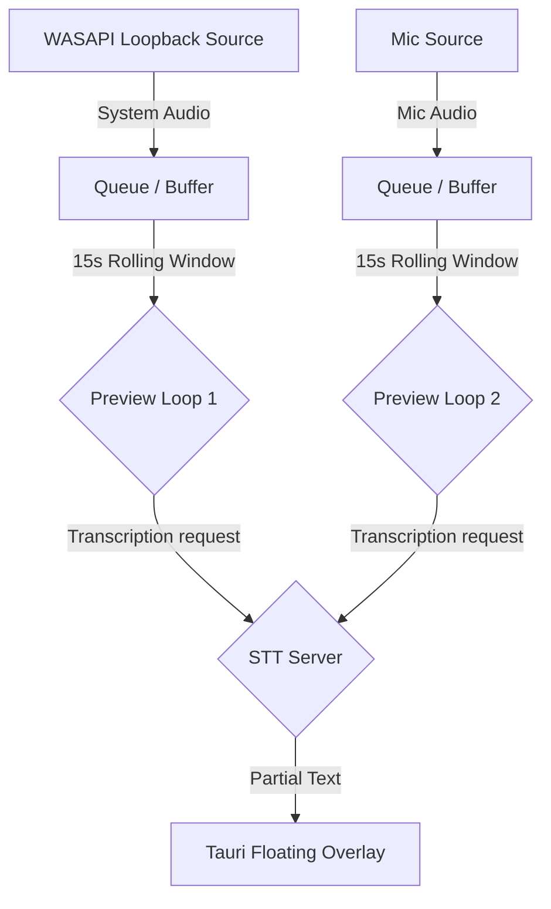

# 🏗️ Architecture Wiki

Phoneme is built as a highly modular, decoupled system. It is composed of three main parts: a headless background daemon, a GUI system tray application, and a command-line interface.

```text
                            ┌──────────────────────────────────┐
                            │          phoneme-daemon          │
                            │ (Headless: audio, queue, catalog)│
                            └───────────────▲──────────────────┘
                                             │
                       named pipe (\\.\pipe\phoneme-daemon)
                                             │
              ┌──────────────────────────────┴──────────────────────────────┐
              │                                                             │
              ▼                                                             ▼
     ┌─────────────────┐                                           ┌─────────────────┐
     │     phoneme     │                                           │  phoneme-tray   │
     │      (CLI)      │                                           │   (Tauri GUI)   │
     └─────────────────┘                                           └─────────────────┘
```

---

## 📂 Workspace Layout & Crate Reference

To enforce boundaries, the repository is split into several workspaces and directories. Each module below is linked to its primary entry point:

| Crate / Directory | Primary Purpose | Key Code Entry Points |
| :--- | :--- | :--- |
| **`phoneme-core`** | Shared models, configurations, SQLite catalog, and LLM providers. | - [`lib.rs`](file:///c:/Users/Namef/Projects/dev/phoneme/crates/phoneme-core/src/lib.rs)<br>- [`catalog.rs`](file:///c:/Users/Namef/Projects/dev/phoneme/crates/phoneme-core/src/catalog.rs) (SQLite & FTS5 search)<br>- [`config.rs`](file:///c:/Users/Namef/Projects/dev/phoneme/crates/phoneme-core/src/config.rs) (TOML parsing & validation)<br>- [`doctor.rs`](file:///c:/Users/Namef/Projects/dev/phoneme/crates/phoneme-core/src/doctor.rs) (system diagnostic checks) |
| **`phoneme-ipc`** | Named pipe transport protocols, JSON codecs, and types. | - [`lib.rs`](file:///c:/Users/Namef/Projects/dev/phoneme/crates/phoneme-ipc/src/lib.rs)<br>- [`schema.rs`](file:///c:/Users/Namef/Projects/dev/phoneme/crates/phoneme-ipc/src/schema.rs) (IPC Request/Response/Event enums)<br>- [`named_pipe.rs`](file:///c:/Users/Namef/Projects/dev/phoneme/crates/phoneme-ipc/src/named_pipe.rs) (Client/Server named pipe transport) |
| **`phoneme-audio`** | Low-level audio capture via `cpal`, resampling, and timeline alignment. | - [`lib.rs`](file:///c:/Users/Namef/Projects/dev/phoneme/crates/phoneme-audio/src/lib.rs)<br>- [`recorder.rs`](file:///c:/Users/Namef/Projects/dev/phoneme/crates/phoneme-audio/src/recorder.rs) (main audio capture thread)<br>- [`meeting_align.rs`](file:///c:/Users/Namef/Projects/dev/phoneme/crates/phoneme-audio/src/meeting_align.rs) (dual-track alignment mathematics) |
| **`phoneme-daemon`** | Background service runner: IPC server, queue worker, and pipeline. | - [`main.rs`](file:///c:/Users/Namef/Projects/dev/phoneme/bin/phoneme-daemon/src/main.rs)<br>- [`pipeline.rs`](file:///c:/Users/Namef/Projects/dev/phoneme/bin/phoneme-daemon/src/pipeline.rs) (transcribe, LLM cleanup, and hook dispatch)<br>- [`whisper_supervisor.rs`](file:///c:/Users/Namef/Projects/dev/phoneme/bin/phoneme-daemon/src/whisper_supervisor.rs) (bundled Whisper process lifecycle) |
| **`phoneme` (CLI)** | Command-line client. Translates CLI commands into IPC requests. | - [`main.rs`](file:///c:/Users/Namef/Projects/dev/phoneme/bin/phoneme/src/main.rs)<br>- [`args.rs`](file:///c:/Users/Namef/Projects/dev/phoneme/bin/phoneme/src/args.rs) (clap command parsing)<br>- [`commands/`](file:///c:/Users/Namef/Projects/dev/phoneme/bin/phoneme/src/commands) (individual subcommand actions) |
| **`src-tauri`** | The Tauri 2 GUI host wrapper. Spawns the daemon and proxies system tray/hotkeys. | - [`lib.rs`](file:///c:/Users/Namef/Projects/dev/phoneme/src-tauri/src/lib.rs)<br>- [`commands.rs`](file:///c:/Users/Namef/Projects/dev/phoneme/src-tauri/src/commands.rs) (IPC command bridges to daemon)<br>- [`overlay.rs`](file:///c:/Users/Namef/Projects/dev/phoneme/src-tauri/src/overlay.rs) (always-on-top preview overlays) |
| **`frontend`** | Single-page app built with Lit, vanilla CSS, and TypeScript. | - [`App.ts`](file:///c:/Users/Namef/Projects/dev/phoneme/frontend/src/App.ts)<br>- [`services/ipc.ts`](file:///c:/Users/Namef/Projects/dev/phoneme/frontend/src/services/ipc.ts) (frontend-Tauri IPC bridge)<br>- [`services/keyboard.ts`](file:///c:/Users/Namef/Projects/dev/phoneme/frontend/src/services/keyboard.ts) (2D grid & Vim shortcut chords) |

---

## 🛠️ Feature Architectures & Data Flows

### 1. Split Pane Layout (`\`)
The split pane layout replaces the legacy side-by-side modal. It allows a developer to compare two recordings or read notes and transcripts in two full-width side-by-side editors.

- **Keyboard Dispatch:** Pressing `\` on the list or detail pane dispatches a `"list-center"` or `"focus-detail"` event. The key handler in [`keyboard.ts`](file:///c:/Users/Namef/Projects/dev/phoneme/frontend/src/services/keyboard.ts) triggers a CustomEvent `phoneme:vim` with action `split`.
- **UI Coordination:** The `RecordingsView` layout component catches this event and toggles its reactive state:
  - If a single recording is open: Splits the screen and loads the recording under the list cursor into the second pane.
  - If exactly two recordings are multi-selected: Opens both side-by-side.
  - The splitter itself is draggable, rendering as a thin divider. A double-click resets it to a 50/50 ratio.

### 2. Zen Mode (`f`)
A keyboard-driven visual layout toggle that hides all surrounding UI "chrome" (header search bar, sidebars, active queue columns) to allow distraction-free reading or editing.

- **State Management:** Zen mode is toggled using the `f` hotkey when a recording is focused, or when browsing the recordings list with no recording open.
- **Chrome Slide-out:** The toggled class `.phoneme-zen-active` is applied to `<body>`. Layout animations are driven by CSS variables under `document.documentElement` (configured dynamically via `interface.animation_speed` in settings).
- **Escape Path:** Pressing `Esc` leaves Zen mode first, restoring the sidebar and header before subsequently closing any open details.

### 3. Doctor & Self-Healing (`phoneme doctor --fix`)
A critical system watchdog that validates config files, checks database integrity, and supervises local servers.

- **Dual interfaces:** The CLI run (`phoneme doctor`) and the GUI's Doctor dashboard query the exact same probes in the backend ([`doctor.rs`](file:///c:/Users/Namef/Projects/dev/phoneme/crates/phoneme-core/src/doctor.rs)).
- **Bundled Server Supervisor:** In bundled Whisper mode, the daemon supervises the lifetime of the `whisper-server.exe` child process ([`whisper_supervisor.rs`](file:///c:/Users/Namef/Projects/dev/phoneme/bin/phoneme-daemon/src/whisper_supervisor.rs)).
- **Fix Remediation:** When a probe fails (e.g. HTTP timeout on a local port), clicking **Fix** or invoking `phoneme doctor --fix` pings the daemon to sweep orphaned port processes, terminate frozen child handles, and respawn the server with correct arguments.

### 4. Auto-Tagging & Approval Pipeline
Automatically suggests metadata tags based on transcript content without auto-applying them (preventing tag clutter).

- **LLM Prompting:** Post-transcription, the daemon reads existing catalog tags ([`tags.rs`](file:///c:/Users/Namef/Projects/dev/phoneme/crates/phoneme-core/src/tags.rs)) and formats a prompt directing the LLM to choose from existing tags first, only inventing new ones if necessary.
- **Deferred Approval:** Tag suggestions are stored as a JSON array in the database (`tag_suggestions` column). They appear in the UI as dashed tag chips.
- **Approval Actions:** Clicking **✓** or **✓ All** promotes a suggestion to a permanent tag relationship (`recording_tags` table), creating the tag entity if it doesn't already exist. Dismissing (**✕**) clears the suggestions.
- **Auto-Apply Existing:** If `auto_apply` is enabled in config, suggestions that match existing tag labels bypass the approval queue and attach immediately.

### 5. Meeting Live Preview & Overlay
Provides a floating, always-on-top desktop overlay showing transcription previews of both call participants in real-time.



- **Dual loops:** Meeting mode captures a dense microphone track and a sparse WASAPI system loopback track. While active, two separate preview loops query transcription segments concurrently.
- **Resource Gating:** Both loops take turns requesting access to the shared local STT model semaphore (`whisper_sem` in [`AppState`](file:///c:/Users/Namef/Projects/dev/phoneme/bin/phoneme-daemon/src/app_state.rs)), ensuring they don't bottleneck each other.
- **Overlay Rendering:** In `recording.meeting_preview = "both"` mode, the Tauri overlay ([`overlay.rs`](file:///c:/Users/Namef/Projects/dev/phoneme/src-tauri/src/overlay.rs)) floats two stacked caption lines (mic on top, system loopback below). In `"toggle"` mode, a single caption line is shown, with a manual button to cycle focus.

---

## ⏱️ Lifecycle of a Recording

1. **Trigger:** An IPC request `RecordStart` or `StartMeeting` is accepted by the daemon over the named pipe.
2. **Capture:** The daemon starts a `cpal` stream resampling to **16 kHz mono `i16`** ([`recorder.rs`](file:///c:/Users/Namef/Projects/dev/phoneme/crates/phoneme-audio/src/recorder.rs)). If pre-roll is active, the microphone buffer is pre-seeded. An initial record entry (`status = recording`) is placed in the catalog.
3. **Partial Preview:** A repeating loop captures the tail of the stream and pushes partial transcripts back to subscribers via `TranscriptionPartial`.
4. **Finalize & Align:** On stop, wav files are written. For meetings, System WASAPI loopback silence alignment calculations are computed ([`meeting_align.rs`](file:///c:/Users/Namef/Projects/dev/phoneme/crates/phoneme-audio/src/meeting_align.rs)). A task payload is dropped into the filesystem `pending/` inbox queue.
5. **Transcribe & Clean:** The `queue_worker` drains the queue, runs the configured transcription provider ([`transcription.rs`](file:///c:/Users/Namef/Projects/dev/phoneme/crates/phoneme-core/src/transcription.rs)), and routes the text through LLM post-processing.
6. **Hooks & Summary:** User-defined action commands, webhooks, and AI summarization are executed serially ([`pipeline.rs`](file:///c:/Users/Namef/Projects/dev/phoneme/bin/phoneme-daemon/src/pipeline.rs)). Status updates to `done` and the inbox payload is cleaned.

---

## 🌐 Communication Protocols

- **Named Pipe:** Local NDJSON IPC server mapped to `\\.\pipe\phoneme-daemon` ([`named_pipe.rs`](file:///c:/Users/Namef/Projects/dev/phoneme/crates/phoneme-ipc/src/named_pipe.rs)).
- **Event Bus:** Event notifications (e.g. `recording_started`, `transcription_partial`, `queue_depth_changed`) are broadcasted using `tokio::sync::broadcast` so all open GUI clients and CLI watchers stay dynamically in sync.

---

## 🗄️ Database Catalog Schema

SQLite database (`catalog.db`) configured in **WAL mode** with an FTS5 virtual table for lightning-fast full-text indexing.

- **`recordings`:** Primary records: `id`, `started_at`, `duration_ms`, `audio_path`, `transcript`, `notes`, `meeting_id`, `track`.
- **`tags` & `recording_tags`:** M-to-N relationships tracking categorizations.
- **`embedding_chunks`:** Sentence-aware ONNX embedding vectors (~80 word chunks) supporting high-performance semantic search ([`embed.rs`](file:///c:/Users/Namef/Projects/dev/phoneme/crates/phoneme-core/src/embed.rs)).
