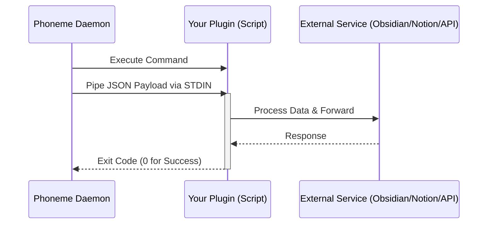

# Plugins and Hooks (Extensibility)

Phoneme's philosophy is simple: **we transcribe your voice, you decide exactly where it goes.** 

To achieve this, Phoneme is built around an extensible, script-based Hook system. While Phoneme v2.0 will introduce a formalized JSON Plugin Registry, the current architecture allows limitless integration by piping JSON directly to user-owned subprocesses.

## The Hook Contract

A "Hook" in Phoneme is simply an executable script (PowerShell, Python, Bash, Node, etc.). Phoneme commits to a single, dead-simple delivery mechanism: **the daemon executes your script and pipes the final transcript as JSON into `stdin`**.

| Channel | Direction | Content |
|---|---|---|
| `stdin` | daemon → hook | One JSON object terminated by EOF |
| `stdout` | hook → daemon | Ignored by the daemon (but captured to `hook.log`) |
| `stderr` | hook → daemon | Captured to `hook.log`; last 4 KB stored in catalog on failure |
| exit code | hook → daemon | `0` = success; non-zero = failure |

### Architecture Flow



## The JSON Payload

Every hook receives a JSON payload that looks like this:

```json
{
  "id": "20260519T143500823",
  "timestamp": "2026-05-19T14:35:00.823-05:00",
  "transcript": "The cleaned, polished transcription text",
  "original_transcript": "The raw whisper output before Smart Cleanup",
  "audio_path": "C:\\Users\\name\\Documents\\phoneme\\audio\\2026-05-19\\143500823.wav",
  "duration_ms": 8470,
  "model": "ggml-base.en",
  "metadata": {
    "phoneme_version": "1.8.0",
    "hook_version": 1
  }
}
```

## Included Reference Hooks

Phoneme ships with several reference hooks out-of-the-box. On first run, they are copied to `%APPDATA%\phoneme\hooks\`. **The installer never overwrites them**, so feel free to edit them to learn how they work.

### General-purpose

| Hook | What it does |
|---|---|
| `to-stdout.ps1` | Echoes the transcript to stdout — use it to verify the pipeline works. |
| `to-clipboard.ps1` | Copies the transcript to the Windows clipboard, ready to paste anywhere. |
| `to-file.ps1` | Appends every transcript to one running Markdown file. |
| `to-markdown-daily.ps1` | Obsidian-style daily note format. |

### Integrations

| Hook | What it does |
|---|---|
| `to-webhook.ps1` | POSTs the transcript as JSON to a webhook (Discord/Slack/n8n/Make.com). |
| `summarize-with-ollama.ps1` | Uses a local Ollama model to summarize the transcript entirely offline. |
| `to-todoist.ps1` | Creates a Todoist task from the note. Designed to be **keyword-triggered** on `"action item:"`. |

## Keyword-Triggered Hooks

You can run specific plugins **only when the transcript matches a phrase**. Configure them in **Settings → Action Hook**, or directly in your `config.toml`:

```toml
[[hook.keyword_rules]]
pattern = "action item:"
command = "powershell -ExecutionPolicy Bypass -File %APPDATA%/phoneme/hooks/to-todoist.ps1"

[[hook.keyword_rules]]
pattern = "TODO"
command = "powershell -ExecutionPolicy Bypass -File %APPDATA%/phoneme/hooks/to-file.ps1"
case_sensitive = true
```

Now, saying *"…action item: send Sarah the contract"* runs the Todoist plugin (which files the task), while ordinary notes are ignored. 

## Writing Your Own Plugin

Writing a plugin is trivial. Because Phoneme handles the audio capture, transcription, and LLM cleanup, your plugin only has to parse a JSON string from stdin.

A minimal Python hook:

```python
#!/usr/bin/env python3
import json, sys
payload = json.load(sys.stdin)
with open("notes.txt", "a") as f:
    f.write(payload["transcript"] + "\n")
```

A minimal bash hook:

```bash
#!/usr/bin/env bash
read -r -d '' payload
echo "$payload" | jq -r '.transcript' >> ~/Documents/notes.txt
```

### Testing Your Hook

To quickly test a hook without speaking, use the Phoneme CLI:

```bash
phoneme hook test
```

This runs your configured hook with a sample payload and prints the exit code, duration, stdout, and stderr.

## Future Roadmap: The Plugin Marketplace

While shell scripts offer incredible power, our v2.0 roadmap includes a formalized **Plugin Marketplace**. 

Plugins will be packaged in a standardized registry, allowing users to browse, install, and configure integrations (like Notion, Jira, or custom CRM pipelines) directly from the Phoneme UI with a single click, rather than managing shell scripts.
