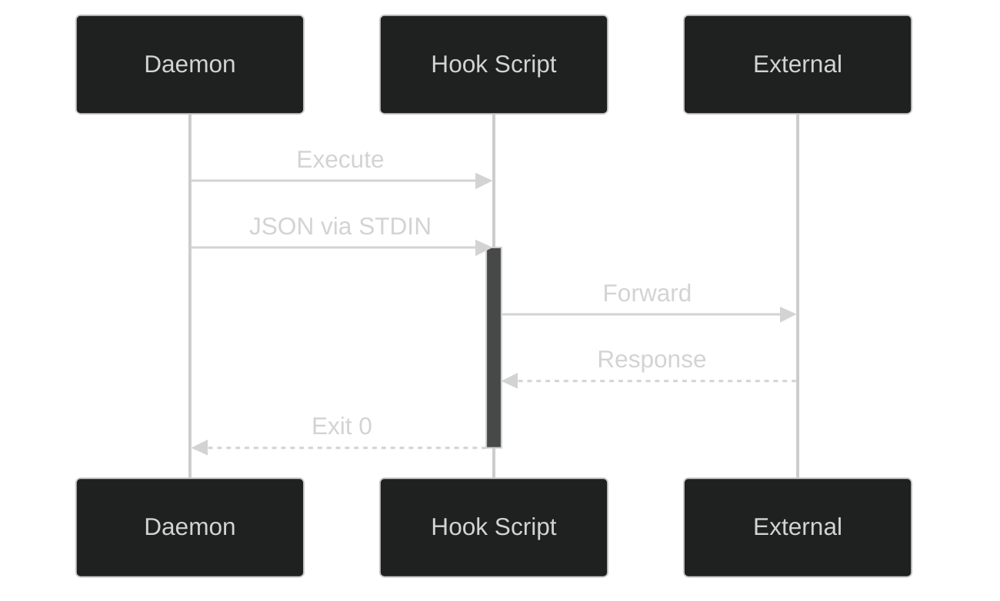

# 🔌 Plugins and Hooks (Extensibility)

Phoneme's philosophy is simple: **we transcribe your voice, you decide exactly where it goes.** 

To achieve this, Phoneme is built around an extensible, script-based Hook system. While Phoneme v2.0 will introduce a formalized JSON Plugin Registry, the current architecture allows limitless integration by piping JSON directly to user-owned subprocesses.

## 📜 The Hook Contract

A "Hook" in Phoneme is simply an executable script (PowerShell, Python, Bash, Node, etc.). Phoneme commits to a single, dead-simple delivery mechanism: **the daemon executes your script and pipes the final transcript as JSON into `stdin`**.

| Channel | Direction | Content |
|---|---|---|
| `stdin` | daemon → hook | One JSON object terminated by EOF |
| `stdout` | hook → daemon | Drained (so the hook can't deadlock on a full pipe) but otherwise unused |
| `stderr` | hook → daemon | On failure, the last ~4 KB is stored in the catalog row's `error_message`; hook activity is also logged to the daemon log |
| exit code | hook → daemon | `0` = success; non-zero = failure |

### 🏛️ Architecture Flow



## 📦 The JSON Payload

Every hook receives a JSON payload that looks like this:

```json
{
  "id": "20260519T143500823",
  "timestamp": "2026-05-19T14:35:00.823-05:00",
  "transcript": "The final transcript (cleaned, if Smart Cleanup is on)",
  "audio_path": "C:\\Users\\name\\Documents\\phoneme\\audio\\2026-05-19\\143500823.wav",
  "duration_ms": 8470,
  "model": "ggml-base.en",
  "metadata": {
    "phoneme_version": "1.8.1",
    "hook_version": 1
  }
}
```

These are **all** the fields a hook receives — the schema is defined by the
`HookPayload` struct in `crates/phoneme-core/src/types.rs`. Notes:

| Field | Type | Meaning |
|---|---|---|
| `id` | string | Recording id; sortable, unique, and safe as a filename. |
| `timestamp` | string | ISO-8601 local time the recording started. |
| `transcript` | string | The **final** transcript — already through Smart Cleanup / post-processing if you have it enabled. |
| `audio_path` | string | Absolute path to the recorded `.wav`. On Windows the backslashes are JSON-escaped (`\\`). |
| `duration_ms` | number | Recording length in milliseconds. |
| `model` | string | The transcription model that produced the text. |
| `metadata.phoneme_version` | string | Phoneme version (semver). |
| `metadata.hook_version` | number | Payload schema version (currently `1`). |

The hook always gets the post-processed `transcript`; the raw pre-cleanup text,
the unedited transcript, the title, and the summary are **not** included in the
payload — fetch them over IPC (`get_original_transcript`, `get_clean_transcript`,
`get_recording`) if a hook needs them. See the
[IPC Integration Guide](ipc_integration.md) for the full command set and wire
format.

### 🔑 Convenience environment variables

For quick one-liners that don't want to parse JSON, the daemon also exports three
environment variables to the hook process:

| Variable | Equivalent JSON field |
|---|---|
| `PHONEME_ID` | `id` |
| `PHONEME_TRANSCRIPT` | `transcript` |
| `PHONEME_AUDIO_PATH` | `audio_path` |

The hook runs with its working directory set to your home folder
(`%USERPROFILE%`).

## 🎁 Included Reference Hooks

Phoneme ships with several reference hooks out-of-the-box. On first run, they are copied to `%APPDATA%\phoneme\hooks\`. **The installer never overwrites them**, so feel free to edit them to learn how they work.

Each script has a header comment explaining what it does, which environment
variables configure it, and that it reads the payload from stdin. Edit them
freely — the installer never overwrites your copies.

### 🛠️ General-purpose

| Hook | What it does | Configure with |
|---|---|---|
| `to-stdout.ps1` | The **default**. Echoes a one-line summary + the transcript to stdout — use it to verify the pipeline works. | — |
| `to-clipboard.ps1` | Copies the transcript to the Windows clipboard, ready to paste anywhere. | — |
| `to-file.ps1` | Appends every transcript to one running Markdown file. | `PHONEME_NOTES_FILE` |
| `to-markdown-daily.ps1` | Obsidian-style daily note: one timestamped bullet per recording in `YYYY-MM-DD.md`, with an `^id` block ref. | `PHONEME_DAILY_DIR` |
| `to-timestamped-note.ps1` | Saves **each** transcript to its own `<id>.md` (with YAML front matter) or `<id>.txt`. | `PHONEME_NOTES_DIR`, `PHONEME_NOTES_EXT` |
| `notify-desktop.ps1` | Pops a Windows desktop notification with a snippet of the transcript. | `PHONEME_NOTIFY_CHARS` |

### 🔗 Integrations

| Hook | What it does | Configure with |
|---|---|---|
| `to-webhook.ps1` | POSTs the transcript as JSON to a webhook (Discord/Slack/n8n/Make.com), or forwards the whole payload. | `PHONEME_WEBHOOK_URL`, `PHONEME_WEBHOOK_FORMAT` |
| `summarize-with-ollama.ps1` | Uses a local Ollama model to summarize the transcript + extract action items, entirely offline. | `PHONEME_OLLAMA_MODEL`, `PHONEME_OLLAMA_URL`, `PHONEME_DAILY_DIR` |
| `to-todoist.ps1` | Creates a Todoist task from the note. Designed to be **keyword-triggered** on `"action item:"`. | `PHONEME_TODOIST_TOKEN` |

### 🧙 Advanced (Emacs / Org-mode)

| Hook | What it does | Configure with |
|---|---|---|
| `to-org-journal.ps1` | Appends each transcript under today's `Log` section in a structured Org daily journal. | `PHONEME_ORG_DIR` |
| `to-denote.ps1` | Creates a Denote-flavoured Org note with a proper `ID--slug__tags.org` filename. | `PHONEME_ORG_DIR` |

These environment variables can be set system-wide (Windows → *Edit the system
environment variables*), or per-hook in your `config.toml` command — though for
secrets like `PHONEME_TODOIST_TOKEN` a system/user env var is preferable so the
token stays out of your config file.

### 🎯 Adding a hook (the Playbook)

Hooks live in the **Playbook** now (**Settings → 🎭 Playbook**). Add a **Hook
entry**, set its **Command** to run a bundled script, then add the entry to a
**recipe** (the *Default pipeline*, or a custom one wired to a hotkey):

1. **Settings → 🎭 Playbook → + Hook**.
2. Set **Command** — the recommended invocation for a bundled script:

   ```
   powershell -NoProfile -ExecutionPolicy Bypass -File %APPDATA%/phoneme/hooks/to-clipboard.ps1
   ```

   - `%APPDATA%` is expanded by Phoneme to your roaming app-data folder, so this
     resolves to `…\phoneme\hooks\to-clipboard.ps1` (`~/` also works).
   - `-NoProfile` skips loading your PowerShell profile (faster, no surprises).
   - `-ExecutionPolicy Bypass` lets the unsigned bundled script run regardless of
     your machine's execution policy.
3. Under **Recipes**, add the Hook entry to a recipe. A recipe is an ordered
   chain, so you can include **several hooks** (each receives the same payload on
   stdin) alongside the AI steps — they run in order.

Optionally set a per-hook **Timeout**, and tick **"Fail the recording if this
hook errors"** when a non-zero exit should quarantine the recording (the default
surfaces failures but keeps the recording usable).

> **Running a recipe on demand.** A recipe isn't just for live recordings: the
> detail-pane **↻ Re-run** modal (and the bulk re-run bar) has a **"Recipe to
> run"** picker, so you can push any existing recording back through a chosen
> recipe — hooks included — without re-recording. Pick **"Default pipeline"** for
> the normal chain. The choice is a **one-time** override for that run (it rides
> the same `pending_recipe` ledger a custom hotkey uses and is never saved to
> config). The CLI mirrors this with `phoneme retranscribe <ID> --recipe <ID|NAME>`
> (and `phoneme record [start|toggle] --recipe <ID|NAME>` for live captures);
> omit the flag for the `default` pipeline.

> **Migrating from `[hook]`?** Older configs used a top-level `[hook]` section
> (`commands` / `keyword_rules` / `webhook_url`). On first launch Phoneme
> **auto-migrates** those into Hook entries on the Default recipe and clears the
> `[hook]` table — a one-time `hooks_migrated` latch. Edit them in the Playbook
> from then on.

## ⚡ Keyword-triggered hooks

A Hook entry can run **only when the transcript matches a phrase**. In the entry
editor, set **"Trigger — only run when the transcript contains…"** to a phrase
(leave it blank to always run), and optionally tick **Match case**:

- Trigger `Action Item:` → a Hook that files the task in Todoist.
- Trigger `TODO` + Match case → a Hook that appends to a file.

Now saying *"…action item: send Sarah the contract"* runs the Todoist Hook,
while ordinary notes are ignored. (The seeded **Capture to-dos** example shows
this with a `Todo:` trigger.)

### How the trigger is evaluated

The trigger is a plain **substring** test against the **post-processed**
transcript — the same text the Hook would receive on stdin, *after* Smart
Cleanup / Transform steps have run. There is no regex or word-boundary matching:
the phrase just has to appear somewhere in the transcript.

| `keyword` | `case_sensitive` | Runs when… |
|---|---|---|
| *(blank)* | — | **always** — the trigger is off |
| `Action Item:` | `false` (default) | the transcript contains `action item:` in any casing |
| `TODO` | `true` | the transcript contains `TODO` exactly (not `todo`) |

This is decided by `PlaybookHook::should_run(transcript)` in
`crates/phoneme-core/src/config.rs`: a blank `keyword` short-circuits to `true`
(**always run**), otherwise it compares with `contains` — lower-casing both sides
unless `case_sensitive` is set.

> **Blank means *always*, not *never*.** This is the one place the Playbook
> trigger differs from the legacy `KeywordRule` it replaced: an empty pattern on
> a migrated keyword rule used to mean "never match", but a Hook entry with a
> blank trigger runs on every recording. Leave the trigger blank for an
> unconditional Hook; set a phrase only when you want it gated.

The gate is checked **per Hook entry**, just before that entry runs. If it
doesn't match, the entry is skipped silently — it isn't counted as run and never
appears in the recording's hook provenance. In a recipe with several Hooks, each
one is gated independently, so you can mix always-on Hooks (clipboard, file
append) with keyword-gated ones (Todoist on `Action Item:`) in the same chain.

## 🚦 Required vs. non-fatal hooks

By default a Hook is a **side-effect**, not a gate: if it fails, the failure is
recorded but the **transcript stays intact and usable**. A flaky webhook or a
clipboard tool that returns non-zero can't trash an otherwise-good recording.
Tick **"Fail the recording if this hook errors"** (the `required` flag on the
Hook entry) only when the side-effect is load-bearing — then a failure
quarantines the whole recording.

What counts as a failure, and what each mode does:

| `required` | A command exits non-zero / fails to spawn, or a webhook errors |
|---|---|
| `false` (default) | Logged (`tracing::warn!`), folded into the recording's step-failure, and the recording is marked **HookFailed** — but the transcript is preserved and the rest of the recipe still runs. |
| `true` | The recipe **short-circuits** with an error; the caller fails the recording the same way the legacy always-on `[hook]` command path did. |

This is implemented in `run_hook_steps` in
`bin/phoneme-daemon/src/pipeline.rs`. For each Hook step that passes its trigger,
both halves (shell command and/or webhook) are run; on failure the function
either `return Err(…)` (when `required`) or records the failure via
`step_failure.get_or_insert(…)` and continues. The last non-zero command exit
code and the summed wall-clock are folded into the recording's **hook provenance**
(`hook_exit_code`, `hook_ms`, the last hook's label), which the detail-pane
**Pipeline** popover reads — so a non-fatal failure is still visible after the
fact even though the transcript survived.

A few details worth knowing:

- **A skipped (untriggered) Hook is never a failure.** The trigger gate runs
  *before* the command/webhook, so a Hook whose keyword didn't match is simply
  not run — `required` has nothing to act on.
- **One entry can do both** a command *and* a webhook; if either half fails and
  the entry is `required`, the recording fails.
- **Both knobs default to "safe":** `required = false` and a blank trigger means
  "run on every recording, but never let it break the recording".

> A `required` Hook is the right tool when the recording is meaningless without
> the side-effect — e.g. a capture that *must* reach your task manager. For
> anything best-effort (notifications, mirrors, nice-to-have syncs), leave it off
> so a transient outage doesn't quarantine good transcripts.

## 🛡️ Webhook hooks & the outbound network policy

A Hook entry can POST the recording payload to a URL instead of (or alongside)
running a script: set the entry's **Webhook URL**. Every outbound webhook —
whether from a Hook entry or migrated from a legacy `[hook] webhook_url` — is
governed by one **global `[webhook]` policy** in `config.toml`, enforced by
`crates/phoneme-core/src/webhook.rs` *before any byte leaves the machine*. The
body is the exact same [JSON payload](#-the-json-payload) a local hook receives.

### Signing the request (HMAC-SHA256)

Set `[webhook] hmac_secret` to a shared secret and every POST carries an
**`X-Phoneme-Signature: sha256=<lowercase-hex>`** header. The value is
`HMAC-SHA256(secret, body)` computed over the **exact body bytes** that go on the
wire (Phoneme serializes the JSON once and signs *that*, so the receiver can
recompute it verbatim). The `sha256=` prefix is the de-facto-standard shape used
by GitHub and Stripe, so receivers verify with off-the-shelf logic. An **empty**
secret (the default) turns signing off — no header is added. The secret is
encrypted at rest and redacted in logs/`Debug`.

A minimal receiver-side check (Python):

```python
import hashlib, hmac
expected = "sha256=" + hmac.new(SECRET.encode(), raw_body, hashlib.sha256).hexdigest()
assert hmac.compare_digest(expected, request.headers["X-Phoneme-Signature"])
```

### Custom headers

`[webhook] custom_headers` is a `name = "value"` table attached to **every**
outbound POST — use it for receiver-specific auth or routing
(`Authorization = "Bearer …"`, an `X-Api-Key`, an `X-Webhook-Source` tag). Two
rules:

- Headers Phoneme owns — **`Content-Type`** (always `application/json`) and the
  **signature header** — are *reserved*. A `custom_headers` entry that collides
  (compared case-insensitively) is **skipped with a warning**, and Phoneme's own
  value wins, so a custom header can't break the content type or forge the
  signature.
- Header *values* can be secrets, so `Debug` on the config prints only the header
  **names**, never the values.

### The SSRF guard (loopback / private / public)

Because Phoneme is local-first, the network policy is **three-tiered** rather than
a blanket private-range block. Every target is validated up front — a DNS name is
resolved and **every** address it yields is classified (most-restrictive wins) —
and the webhook client **never follows redirects**, so a mistyped or hostile URL
(or a 3xx bounce) can't smuggle your transcripts to an internal service.

| Tier | What it covers | Policy |
|---|---|---|
| **Loopback** | `127.0.0.0/8`, `::1`, the literal `localhost` | **Always allowed**, any scheme — no knob can break it (local n8n / Home Assistant / script servers). |
| **Private** | RFC1918 (`10/8`, `172.16/12`, `192.168/16`), link-local `169.254/16`, CGNAT `100.64/10`, IPv6 ULA `fc00::/7`, IPv6 link-local `fe80::/10`, the unspecified addresses | **Blocked** unless `[webhook] allow_private_network = true`. |
| **Public** | everything else | Must be **`https://`** unless `[webhook] allow_http = true`. |

Hardening details the guard handles for you: IPv4-mapped (`::ffff:a.b.c.d`) and
NAT64 (`64:ff9b::/96`) addresses are classified by the v4 host they reach (no
bypass); decimal/octal IPv4 literals are canonicalized before classification; and
a DNS name that resolves to a private address is treated as private. The
validated addresses are **pinned** for the actual send, closing the
re-resolution (DNS-rebinding) TOCTOU window. A blocked target fails with
`Error::InvalidConfig` *naming the exact knob to flip*; the POST is never
attempted.

When a webhook is rejected by policy or errors, it behaves like any other Hook
failure — non-fatal unless the Hook entry is **`required`** (see above).

See the [Threat model → Mitigations in place](threat_model.md#mitigations-in-place)
(item **S-H1**) for the full rationale and the `[webhook]` keys in the
[Config reference](config_reference.md#webhook).

## ⌨️ Writing Your Own Plugin

Writing a plugin is trivial. Because Phoneme handles the audio capture, transcription, and LLM cleanup, your plugin only has to parse a JSON string from stdin.

A minimal Python hook:

```python
#!/usr/bin/env python3
import json, sys
payload = json.load(sys.stdin)
with open("notes.txt", "a") as f:
    f.write(payload["transcript"] + "\n")
```

A minimal bash hook:

```bash
#!/usr/bin/env bash
read -r -d '' payload
echo "$payload" | jq -r '.transcript' >> ~/Documents/notes.txt
```

### Testing Your Hook

To quickly test a hook without speaking, use the Phoneme CLI:

```bash
phoneme hook test
```

This runs your configured hook with a sample payload and prints the exit code, duration, stdout, and stderr.

## 🔮 Future Roadmap: The Plugin Marketplace

While shell scripts offer incredible power, our v2.0 roadmap includes a formalized **Plugin Marketplace**. 

Plugins will be packaged in a standardized registry, allowing users to browse, install, and configure integrations (like Notion, Jira, or custom CRM pipelines) directly from the Phoneme UI with a single click, rather than managing shell scripts.
