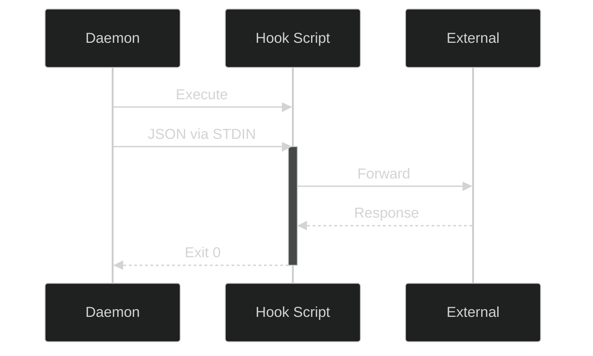

# 🔌 Plugins and Hooks (Extensibility)

Phoneme's philosophy is simple: **we transcribe your voice, you decide exactly where it goes.** 

To achieve this, Phoneme is built around an extensible, script-based Hook system. While Phoneme v2.0 will introduce a formalized JSON Plugin Registry, the current architecture allows limitless integration by piping JSON directly to user-owned subprocesses.

## 📜 The Hook Contract

A "Hook" in Phoneme is simply an executable script (PowerShell, Python, Bash, Node, etc.). Phoneme commits to a single, dead-simple delivery mechanism: **the daemon executes your script and pipes the final transcript as JSON into `stdin`**.

| Channel | Direction | Content |
|---|---|---|
| `stdin` | daemon → hook | One JSON object terminated by EOF |
| `stdout` | hook → daemon | Drained (so the hook can't deadlock on a full pipe) but otherwise unused |
| `stderr` | hook → daemon | On failure, the last ~4 KB is stored in the catalog row's `error_message`; hook activity is also logged to the daemon log |
| exit code | hook → daemon | `0` = success; non-zero = failure |

### 🏛️ Architecture Flow



## 📦 The JSON Payload

Every hook receives a JSON payload that looks like this:

```json
{
  "id": "20260519T143500823",
  "timestamp": "2026-05-19T14:35:00.823-05:00",
  "transcript": "The final transcript (cleaned, if Smart Cleanup is on)",
  "audio_path": "C:\\Users\\name\\Documents\\phoneme\\audio\\2026-05-19\\143500823.wav",
  "duration_ms": 8470,
  "model": "ggml-base.en",
  "metadata": {
    "phoneme_version": "1.8.1",
    "hook_version": 1
  }
}
```

These are **all** the fields a hook receives — the schema is defined by the
`HookPayload` struct in `crates/phoneme-core/src/types.rs`. Notes:

| Field | Type | Meaning |
|---|---|---|
| `id` | string | Recording id; sortable, unique, and safe as a filename. |
| `timestamp` | string | ISO-8601 local time the recording started. |
| `transcript` | string | The **final** transcript — already through Smart Cleanup / post-processing if you have it enabled. |
| `audio_path` | string | Absolute path to the recorded `.wav`. On Windows the backslashes are JSON-escaped (`\\`). |
| `duration_ms` | number | Recording length in milliseconds. |
| `model` | string | The transcription model that produced the text. |
| `metadata.phoneme_version` | string | Phoneme version (semver). |
| `metadata.hook_version` | number | Payload schema version (currently `1`). |

The hook always gets the post-processed `transcript`; the raw pre-cleanup text,
the unedited transcript, the title, and the summary are **not** included in the
payload — fetch them over IPC (`get_original_transcript`, `get_clean_transcript`,
`get_recording`) if a hook needs them. See the
[IPC Integration Guide](ipc_integration.md) for the full command set and wire
format.

### 🔑 Convenience environment variables

For quick one-liners that don't want to parse JSON, the daemon also exports three
environment variables to the hook process:

| Variable | Equivalent JSON field |
|---|---|
| `PHONEME_ID` | `id` |
| `PHONEME_TRANSCRIPT` | `transcript` |
| `PHONEME_AUDIO_PATH` | `audio_path` |

The hook runs with its working directory set to your home folder
(`%USERPROFILE%`).

## 🎁 Included Reference Hooks

Phoneme ships with several reference hooks out-of-the-box. On first run, they are copied to `%APPDATA%\phoneme\hooks\`. **The installer never overwrites them**, so feel free to edit them to learn how they work.

Each script has a header comment explaining what it does, which environment
variables configure it, and that it reads the payload from stdin. Edit them
freely — the installer never overwrites your copies.

### 🛠️ General-purpose

| Hook | What it does | Configure with |
|---|---|---|
| `to-stdout.ps1` | The **default**. Echoes a one-line summary + the transcript to stdout — use it to verify the pipeline works. | — |
| `to-clipboard.ps1` | Copies the transcript to the Windows clipboard, ready to paste anywhere. | — |
| `to-file.ps1` | Appends every transcript to one running Markdown file. | `PHONEME_NOTES_FILE` |
| `to-markdown-daily.ps1` | Obsidian-style daily note: one timestamped bullet per recording in `YYYY-MM-DD.md`, with an `^id` block ref. | `PHONEME_DAILY_DIR` |
| `to-timestamped-note.ps1` | Saves **each** transcript to its own `<id>.md` (with YAML front matter) or `<id>.txt`. | `PHONEME_NOTES_DIR`, `PHONEME_NOTES_EXT` |
| `notify-desktop.ps1` | Pops a Windows desktop notification with a snippet of the transcript. | `PHONEME_NOTIFY_CHARS` |

### 🔗 Integrations

| Hook | What it does | Configure with |
|---|---|---|
| `to-webhook.ps1` | POSTs the transcript as JSON to a webhook (Discord/Slack/n8n/Make.com), or forwards the whole payload. | `PHONEME_WEBHOOK_URL`, `PHONEME_WEBHOOK_FORMAT` |
| `summarize-with-ollama.ps1` | Uses a local Ollama model to summarize the transcript + extract action items, entirely offline. | `PHONEME_OLLAMA_MODEL`, `PHONEME_OLLAMA_URL`, `PHONEME_DAILY_DIR` |
| `to-todoist.ps1` | Creates a Todoist task from the note. Designed to be **keyword-triggered** on `"action item:"`. | `PHONEME_TODOIST_TOKEN` |

### 🧙 Advanced (Emacs / Org-mode)

| Hook | What it does | Configure with |
|---|---|---|
| `to-org-journal.ps1` | Appends each transcript under today's `Log` section in a structured Org daily journal. | `PHONEME_ORG_DIR` |
| `to-denote.ps1` | Creates a Denote-flavoured Org note with a proper `ID--slug__tags.org` filename. | `PHONEME_ORG_DIR` |

These environment variables can be set system-wide (Windows → *Edit the system
environment variables*), or per-hook in your `config.toml` command — though for
secrets like `PHONEME_TODOIST_TOKEN` a system/user env var is preferable so the
token stays out of your config file.

### 🎯 Adding a hook (the Playbook)

Hooks live in the **Playbook** now (**Settings → 🎭 Playbook**). Add a **Hook
entry**, set its **Command** to run a bundled script, then add the entry to a
**recipe** (the *Default pipeline*, or a custom one wired to a hotkey):

1. **Settings → 🎭 Playbook → + Hook**.
2. Set **Command** — the recommended invocation for a bundled script:

   ```
   powershell -NoProfile -ExecutionPolicy Bypass -File %APPDATA%/phoneme/hooks/to-clipboard.ps1
   ```

   - `%APPDATA%` is expanded by Phoneme to your roaming app-data folder, so this
     resolves to `…\phoneme\hooks\to-clipboard.ps1` (`~/` also works).
   - `-NoProfile` skips loading your PowerShell profile (faster, no surprises).
   - `-ExecutionPolicy Bypass` lets the unsigned bundled script run regardless of
     your machine's execution policy.
3. Under **Recipes**, add the Hook entry to a recipe. A recipe is an ordered
   chain, so you can include **several hooks** (each receives the same payload on
   stdin) alongside the AI steps — they run in order.

Optionally set a per-hook **Timeout**, and tick **"Fail the recording if this
hook errors"** when a non-zero exit should quarantine the recording (the default
surfaces failures but keeps the recording usable).

> **Migrating from `[hook]`?** Older configs used a top-level `[hook]` section
> (`commands` / `keyword_rules` / `webhook_url`). On first launch Phoneme
> **auto-migrates** those into Hook entries on the Default recipe and clears the
> `[hook]` table — a one-time `hooks_migrated` latch. Edit them in the Playbook
> from then on.

## ⚡ Keyword-triggered hooks

A Hook entry can run **only when the transcript matches a phrase**. In the entry
editor, set **"Trigger — only run when the transcript contains…"** to a phrase
(leave it blank to always run), and optionally tick **Match case**:

- Trigger `Action Item:` → a Hook that files the task in Todoist.
- Trigger `TODO` + Match case → a Hook that appends to a file.

Now saying *"…action item: send Sarah the contract"* runs the Todoist Hook,
while ordinary notes are ignored. (The seeded **Capture to-dos** example shows
this with a `Todo:` trigger.)

## ⌨️ Writing Your Own Plugin

Writing a plugin is trivial. Because Phoneme handles the audio capture, transcription, and LLM cleanup, your plugin only has to parse a JSON string from stdin.

A minimal Python hook:

```python
#!/usr/bin/env python3
import json, sys
payload = json.load(sys.stdin)
with open("notes.txt", "a") as f:
    f.write(payload["transcript"] + "\n")
```

A minimal bash hook:

```bash
#!/usr/bin/env bash
read -r -d '' payload
echo "$payload" | jq -r '.transcript' >> ~/Documents/notes.txt
```

### Testing Your Hook

To quickly test a hook without speaking, use the Phoneme CLI:

```bash
phoneme hook test
```

This runs your configured hook with a sample payload and prints the exit code, duration, stdout, and stderr.

## 🔮 Future Roadmap: The Plugin Marketplace

While shell scripts offer incredible power, our v2.0 roadmap includes a formalized **Plugin Marketplace**. 

Plugins will be packaged in a standardized registry, allowing users to browse, install, and configure integrations (like Notion, Jira, or custom CRM pipelines) directly from the Phoneme UI with a single click, rather than managing shell scripts.
