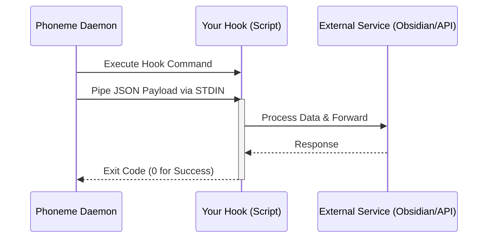

# Phoneme Hooks Pipeline

Hooks are the core of Phoneme's extensibility. Phoneme's philosophy is simple: **we transcribe your voice, you decide where it goes.** 

Phoneme commits to a single, dead-simple delivery mechanism: **a user-owned subprocess receives the final transcript as JSON on `stdin`**.

## The Contract

| Channel | Direction | Content |
|---|---|---|
| `stdin` | daemon → hook | One JSON object terminated by EOF |
| `stdout` | hook → daemon | Ignored by the daemon (but captured to `hook.log`) |
| `stderr` | hook → daemon | Captured to `hook.log`; last 4 KB stored in catalog on non-zero exit |
| exit code | hook → daemon | `0` = success; non-zero = failure |
| timeout | daemon enforces | Configured via `hook.timeout_secs` (default 30) |
| env vars | daemon sets | `PHONEME_ID`, `PHONEME_AUDIO_PATH`, `PHONEME_TRANSCRIPT` |

### Architecture Flow



> [!WARNING]
> Security Risk: The `PHONEME_TRANSCRIPT` environment variable contains raw, unsanitized user voice-to-text. While environment variables are generally safe, using `$env:PHONEME_TRANSCRIPT` inside `Invoke-Expression` or similar shell eval wrappers exposes your hook to command injection. **Always prefer parsing the JSON payload via stdin (`$payload.transcript`) instead of relying on the environment variable.**

## The JSON Payload

Every hook receives a JSON payload that looks like this:

```json
{
  "id": "20260519T143500823",
  "timestamp": "2026-05-19T14:35:00.823-05:00",
  "transcript": "The cleaned transcription text",
  "audio_path": "C:\\Users\\matt\\Documents\\phoneme\\audio\\2026-05-19\\143500823.wav",
  "duration_ms": 8470,
  "model": "ggml-base.en",
  "metadata": {
    "phoneme_version": "1.8.0",
    "hook_version": 1
  }
}
```

## Discovery and Invocation

Hooks do not need to be on your `PATH`. The full command string is invoked via the system shell:
- `.ps1` → `powershell -ExecutionPolicy Bypass -File <path>`
- `.exe` / `.bat` / `.cmd` → invoked directly
- Anything else → invoked directly (you're responsible for making it executable)

## Reference Hooks

Phoneme ships nine reference hooks. On first run, they're copied to `%APPDATA%\phoneme\hooks\`. **The installer never overwrites them**, so feel free to edit and experiment. 

### General-purpose

| Hook | What it does |
|---|---|
| `to-stdout.ps1` | The default. Echoes the transcript to stdout — use it to verify the pipeline works. |
| `to-clipboard.ps1` | Copies the transcript to the Windows clipboard, ready to paste anywhere. |
| `to-file.ps1` | Appends every transcript (timestamped) to one running Markdown file. Destination defaults to `~/Documents/VoiceNotes.md`; override with the `PHONEME_NOTES_FILE` env var. |
| `to-markdown-daily.ps1` | Obsidian-style daily note at `~/Documents/notes/YYYY-MM-DD.md`: `- **14:35** — … ^20260519T143500823` |

### Integrations

| Hook | What it does |
|---|---|
| `to-webhook.ps1` | POSTs the transcript as JSON to a webhook (Discord/Slack/n8n/your own server). Set `PHONEME_WEBHOOK_URL`. A spoken note can hit a team channel or automation the instant you stop talking. |
| `summarize-with-ollama.ps1` | Sends the transcript to a **local** Ollama model and saves a summary + action items to `~/Documents/notes/YYYY-MM-DD-summaries.md` — fully offline, no API keys. Set `PHONEME_OLLAMA_MODEL` (default `llama3.2:3b`). |
| `to-todoist.ps1` | Creates a Todoist task from the note. Designed to be **keyword-triggered** on `"action item:"` so only your action items become tasks. Set `PHONEME_TODOIST_TOKEN`. |

## Keyword-Triggered Hooks

Run an extra command **only when the transcript matches a phrase** — on top of the always-on `commands`. Configure them in **Settings → Action Hook**, or in `config.toml`:

```toml
[[hook.keyword_rules]]
pattern = "action item:"   # matched case-insensitively unless case_sensitive = true
command = "powershell -ExecutionPolicy Bypass -File %APPDATA%/phoneme/hooks/to-todoist.ps1"

[[hook.keyword_rules]]
pattern = "TODO"
command = "powershell -ExecutionPolicy Bypass -File %APPDATA%/phoneme/hooks/to-file.ps1"
case_sensitive = true
```

Now saying *"…action item: send Sarah the contract"* runs `to-todoist.ps1` (which strips the `action item:` prefix and files the task), while ordinary notes are left alone. 

## Writing Your Own Hook

A minimal PowerShell hook:

```powershell
$payload = $input | Out-String | ConvertFrom-Json
Write-Output $payload.transcript
```

A minimal bash hook (Git Bash / WSL):

```bash
#!/usr/bin/env bash
read -r -d '' payload
echo "$payload" | jq -r '.transcript' >> ~/Documents/notes.txt
```

A minimal Python hook:

```python
#!/usr/bin/env python3
import json, sys
payload = json.load(sys.stdin)
with open("notes.txt", "a") as f:
    f.write(payload["transcript"] + "\n")
```

## Testing Your Hook

To quickly test a hook without speaking, run:

```bash
phoneme hook test
```

This runs your configured hook with a sample payload and prints the exit code, duration, stdout, and stderr.

## Common Gotchas

- **PowerShell Execution Policy**: Signed hooks aren't required; the installer launches PowerShell with `-ExecutionPolicy Bypass`.
- **Timeouts**: If your hook does network I/O, bump `hook.timeout_secs` in your config.
- **Working Directory**: Hooks run with cwd set to `%USERPROFILE%`. Use absolute paths or `~` if you depend on a specific location.
- **Encoding**: PowerShell defaults to UTF-16 for `Out-File`. Use `Set-Content -Encoding UTF8` (or `[System.IO.File]::WriteAllText`) when writing files that other tools will read.
