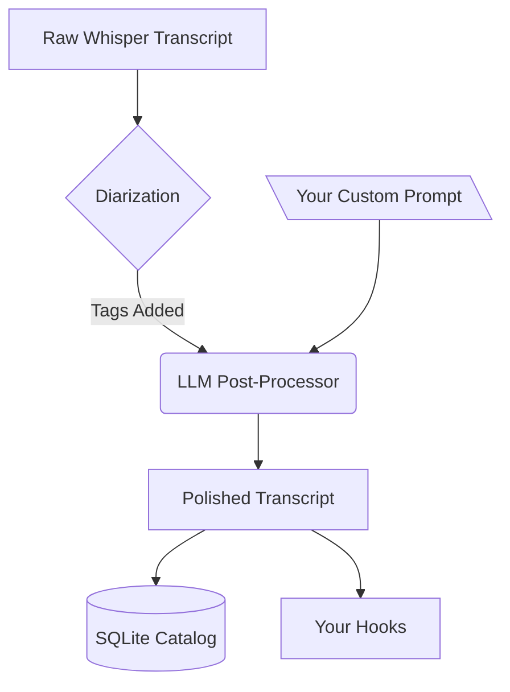

# Smart Cleanup (LLM Post-Processing)

Phoneme includes a built-in **Smart Cleanup** feature.

Instead of just getting raw, sometimes imperfect Whisper transcriptions, Phoneme can pipe your transcript through a Large Language Model (LLM) before saving it. This allows you to automatically remove stutters, fix phonetic misunderstandings, translate languages on-the-fly, or format your spoken thoughts into clean bullet points.

## How it works

When Smart Cleanup is enabled, the pipeline looks like this:

1. You finish speaking.
2. Whisper transcribes the audio.
3. If Local Diarization is enabled, Pyannote identifies who is speaking and adds `[Speaker 1]: ` tags.
4. **The LLM takes the raw transcript, follows your exact Prompt instructions, and rewrites it.**
5. The finalized text is saved to your database and sent to your Hooks.

## Provider Options

You can run your LLM locally or use a cloud provider for speed and convenience. Configure this under **Settings → Smart Cleanup (AI)**.

### Local AI (Free & Offline)

For the ultimate privacy-respecting, local-first experience, you can run the LLM locally on your own hardware using Ollama.

1. Download and install [Ollama](https://ollama.com/).
2. Open your terminal and run: `ollama run llama3.2:3b`. This will download a highly capable, fast, 3-billion parameter model.
3. In Phoneme's Settings:
   - Check **Enable Smart Cleanup**
   - **AI Provider**: `Local Ollama`
   - **Model Name**: `llama3.2:3b`
   - **API Key**: Leave blank.

### Cloud Providers (OpenAI, Anthropic, Groq)

If you don't have the hardware to run Ollama smoothly, or want the absolute best reasoning capabilities, use a cloud API:

1. Select your **AI Provider** (`OpenAI`, `Anthropic`, `Groq`, or `Custom OpenAI-Compatible`).
2. Enter the Model Name (e.g., `gpt-4o`, `claude-3-5-sonnet-latest`, `llama-3.1-8b-instant`).
3. Enter your API Key.

## Prompts & Presets

The magic of the LLM is in the prompt. You can select one of our default presets, or write your own.

> [!WARNING]
> You **must** instruct the AI to reply ONLY with the final text. Otherwise, the AI might add conversational filler like *"Here is your cleaned transcript:"* which will ruin your notes!

### Useful Prompt Ideas

> [!TIP]
> **The Dysfluency Fixer**
> I have a speech impediment that causes me to stutter and repeat sounds. Carefully clean up the transcript so it flows perfectly, removing any dysfluency while preserving my intended meaning. Reply ONLY with the cleaned text.

> [!TIP]
> **The Executive Assistant**
> Format this raw transcript into a clean, professional meeting note. Use bullet points or headings if appropriate. Output ONLY the formatted notes and absolutely no conversational filler.

> [!TIP]
> **The Universal Translator**
> Translate this transcript into perfect English. Keep the meaning exact and natural. Output ONLY the English translation and absolutely nothing else.

> [!TIP]
> **The Meeting Summarizer (Requires Diarization)**
> This is a multi-speaker transcript. Provide a concise summary of the decisions made, and list the action items assigned to each speaker. Output ONLY the summary and action items.

Enjoy perfectly polished transcripts!
