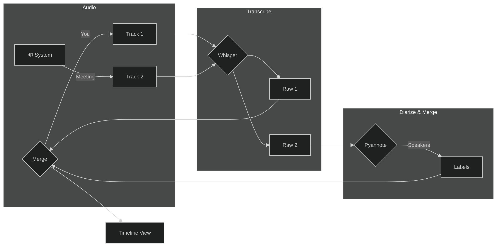

# 👥 Meeting Mode (Dual-Track Recording)

Are you tired of taking notes while trying to actively participate in a video call? Phoneme's **Meeting Mode** is designed specifically for this scenario.

Instead of just recording your microphone, Meeting Mode captures *both* your microphone and your computer's system audio (what you hear through your speakers) simultaneously, as two separate but linked tracks.

## ⚙️ How to Enable Meeting Mode

1. Open Phoneme.
2. Click the **Meeting Mode** toggle (the icon next to the main Record button).
3. Phoneme will immediately begin recording two streams:
   - **Mic Track**: Your own voice.
   - **System Track**: The voices of everyone else on the call (Zoom, Teams, Google Meet, etc.).

## Shared wall-clock timeline

Both tracks are saved as WAV files of the **same total duration** — the wall-clock time from meeting start to stop. That lets you scrub either waveform to the same second and hear what was happening at that moment in the meeting.

| Track | What it captures | Timeline behavior |
|-------|------------------|-------------------|
| **Mic** | Your voice from meeting start | Continuous — speech from t=0 |
| **System** | WASAPI loopback (call/video audio) | Often **sparse** — Windows may only deliver samples when something is actually playing |

When system audio starts late (you speak first, then share a video at 5 s), Phoneme **places** the system segment at the wall-clock instant it began — not at t=0. You should see leading silence on the system waveform, then call audio, then trailing silence.

**Example:** You talk for 5 s, start a 15 s video, wrap up for 5 s → ~25 s meeting. System WAV: ~5 s flat, ~15 s video audio, ~5 s flat. Mic WAV: your voice across the full 25 s. Scrubbing both to 10 s should match what you heard live.

> [!TIP]
> Daemon logs on stop include `sparse`, `placement_ms`, and `first_content_from_wall_ms` for the system track — useful when verifying alignment.

## ✨ Why Dual-Track is Magic

When the meeting ends, Phoneme transcribes both tracks independently. Because they share a wall-clock timeline, the **Merged Conversation View** can interleave them chronologically.

Instead of a giant block of text, you get a beautiful, chronological timeline of the conversation, exactly as it happened:

Expand a meeting group in the recordings list, then open the **merged conversation** view to see mic and system lines interleaved by timestamp.

### 🗣️ Adding Speaker Diarization

If you want to take this to the next level, you can enable **Offline Speaker Diarization** in **Settings → Whisper**.

By default, the System Track is just one long transcript of everyone on the call. But with Diarization enabled, Phoneme uses a powerful AI model (Pyannote) to analyze the System Track and separate the different voices.

Your final transcript will look like this:

- **[You]**: "What do we think about the new design?"
- **[Speaker 1]**: "I love it, but we need to tweak the colors."
- **[Speaker 2]**: "Agreed, let's make it more vibrant."

## 🏆 Best Practices for Meeting Mode

> [!TIP]
> **Use Headphones!** If you use speakers, your microphone will pick up the audio coming from your speakers. This causes an "echo" where the other people on the call are transcribed on *both* the System track and your Mic track. Always wear headphones when using Meeting Mode.

> [!TIP]
> **Combine with Smart Cleanup.** Use the Meeting Summarizer prompt in Smart Cleanup: *"This is a multi-speaker transcript. Provide a concise summary of the decisions made, and list the action items assigned to each speaker."* Phoneme will automatically generate a pristine summary of the entire meeting.
