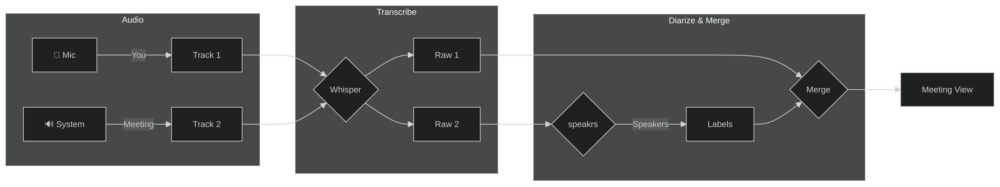

# 👥 Meeting Mode (Dual-Track Recording)

Are you tired of taking notes while trying to actively participate in a video call? Phoneme's **Meeting Mode** is designed specifically for this scenario.

Instead of just recording your microphone, Meeting Mode captures *both* your microphone and your computer's system audio (what you hear through your speakers) simultaneously, as two separate but linked tracks.

## ⚙️ How to Enable Meeting Mode

1. Open Phoneme.
2. Click the **Meeting Mode** toggle (the icon next to the main Record button).
3. Phoneme will immediately begin recording two streams:
   - **Mic Track**: Your own voice.
   - **System Track**: The voices of everyone else on the call (Zoom, Teams, Google Meet, etc.).


## Shared wall-clock timeline

Both tracks are saved as WAV files of the **same total duration** — the wall-clock time from meeting start to stop. That lets you scrub either waveform to the same second and hear what was happening at that moment in the meeting.

| Track | What it captures | Timeline behavior |
|-------|------------------|-------------------|
| **Mic** | Your voice from meeting start | Continuous — speech from t=0 |
| **System** | WASAPI loopback (call/video audio) | Often **sparse** — Windows may only deliver samples when something is actually playing |

When system audio starts late (you speak first, then share a video at 5 s), Phoneme **places** the system segment at the wall-clock instant it began — not at t=0. You should see leading silence on the system waveform, then call audio, then trailing silence.

**Example:** You talk for 5 s, start a 15 s video, wrap up for 5 s → ~25 s meeting. System WAV: ~5 s flat, ~15 s video audio, ~5 s flat. Mic WAV: your voice across the full 25 s. Scrubbing both to 10 s should match what you heard live.

> [!TIP]
> Daemon logs on stop include `sparse`, `placement_ms`, and `first_content_from_wall_ms` for the system track — useful when verifying alignment.

## ✨ Why dual-track helps

When the meeting ends, Phoneme transcribes both tracks independently. Because they share a wall-clock timeline, you can review them together in one place.



In the recordings list, a meeting's two tracks are grouped under one entry. Click the meeting's **group header** to open the **merged conversation** view: a single, read-only reading of the whole meeting. When both tracks carry segment timing (anything transcribed since segment capture landed), the view is a **chronological chat timeline** — your mic turns on the left, the meeting's on the right, every turn stamped with its clock offset, in the real order people spoke. Older meetings without timing fall back to the by-source layout (each track as a labelled section — **🎤 Microphone**, then **🔊 System audio**). A toolbar offers **Copy** and **Export** of the merged text (timestamped lines in chronological mode). To edit a single track (full editor, waveform, notes, re-transcribe), expand the group and click that track's row instead.

### 🕒 Dual timeline (side-by-side, synced)

From the merged view, click **🕒 Dual timeline** (or press `\`) to explode the
meeting into two side-by-side panes — one per track — each showing its
transcript as a clickable, time-coded **timeline**. The two tracks share a
wall-clock at capture time, so the panes stay in lock-step:

- **Click any line** to jump *both* waveforms to that moment — hear what the
  meeting said and what you said at the same point in time.
- **Scrolling one timeline scrolls the other** to the same time offset.
- The line under the playhead stays highlighted as audio plays.
- **Esc** (or a pane's ✕) collapses the split and returns to the merged view.

The same timeline is available for any single recording via the **🕒 Timeline**
button in the detail pane's transcript box.

> [!NOTE]
> Segment timing is captured at transcription time, so recordings transcribed
> before this feature have no timeline yet — hit **Re-run → Transcribe** on
> each track to backfill it; the merged view then upgrades itself from the
> by-source layout to the chronological timeline automatically.


### 🗣️ Adding Speaker Diarization

If you want to take this to the next level, you can enable **Speaker Diarization** in **Settings → Diarization → Speaker Diarization**. Local diarization (the **speakrs** model) runs entirely on your machine; cloud options are available too. See [Whisper & Diarization](diarization_and_whisper.md) for the backends and how they pair with your transcription provider.

By default, the System Track is one long transcript of everyone on the call. With Diarization enabled, Phoneme runs the speakrs model on the System Track to separate the different voices.

> [!NOTE]
> **Your Mic Track is always you.** Phoneme knows the mic track is a single voice — yours — so it never runs the diarizer on it. The whole mic transcript is labelled **You** directly. That halves the diarizer's work per meeting (only the System Track is analyzed) and avoids the model accidentally splitting your own voice into several "speakers". The label is a normal speaker name, so you can rename **You** to anything you like, just like any other speaker.

Your final transcript will look like this:

- **[You]**: "What do we think about the new design?"
- **[Speaker 1]**: "I love it, but we need to tweak the colors."
- **[Speaker 2]**: "Agreed, let's make it more vibrant."

> [!TIP]
> **Name a speaker once and Phoneme remembers them.** Renaming `Speaker 1` to a
> teammate's name enrolls their voice, so your next meeting's merged view suggests
> *"🔎 Recognized voices: Speaker N sounds like &lt;name&gt;"* — label the regulars
> with one click. See [Recognize named speakers](diarization_and_whisper.md) for the
> full flow and the Speaker Library.

## 📋 Meeting templates (structured digests)

A meeting's whole-conversation digest is a **selectable template**, not one fixed
prompt — so the rollup can match the *kind* of meeting. Phoneme ships three:

- **Meeting digest** (default) — a concise summary of decisions and action items.
- **Standup** — grouped by participant: what each person did, what's next, and any
  blockers, ending with action items.
- **Interview** — structured as the questions asked and the answers given.

Pick the active template three ways:

- the **Meeting template** selector in **Settings → 🎭 Playbook** — applies to
  every meeting, both the automatic digest and on-demand re-runs;
- the template **picker in the merged meeting view** — a one-shot for just that
  re-run, never saved;
- the CLI: `phoneme meeting digest <meeting-id> --template standup`.

Leaving it on the default **Meeting digest** is identical to Phoneme's original
behavior, so nothing changes until you choose a template. A template reuses your
configured **Summary** provider/model — with **Local Ollama** the meeting
transcript never leaves your machine. Templates are ordinary Playbook recipes:
duplicate one and edit its prompt in the Playbook manager to write your own.

## 📆 Period digests

A **meeting digest** rolls up one meeting. A **period digest** rolls up a whole
**date range** — every recording in it, meetings and voice notes alike — into one
LLM summary. It's a third scope above the per-recording
[summary](smart_cleanup.md) and the per-meeting digest above:

```bash
phoneme digest --daily          # today (the default with no range flag)
phoneme digest --weekly         # the last 7 days
phoneme digest --since 2026-06-15 --until 2026-06-21   # a custom range
phoneme digest --weekly --show  # print the stored digest without regenerating
```

It reuses your configured **Summary** provider/model (`--model` overrides it for
one run only). Period digests are stored per range and **travel with `.zip`
backups** (see [Exporting & Backup](exporting_and_backup.md)).

## 🏆 Best Practices for Meeting Mode

> [!TIP]
> **Use Headphones!** If you use speakers, your microphone will pick up the audio coming from your speakers. This causes an "echo" where the other people on the call are transcribed on *both* the System track and your Mic track. Always wear headphones when using Meeting Mode.

> [!TIP]
> **Combine with Smart Cleanup.** Use the Meeting Summarizer prompt in Smart Cleanup: *"This is a multi-speaker transcript. Provide a concise summary of the decisions made, and list the action items assigned to each speaker."* Phoneme will automatically generate a pristine summary of the entire meeting.
