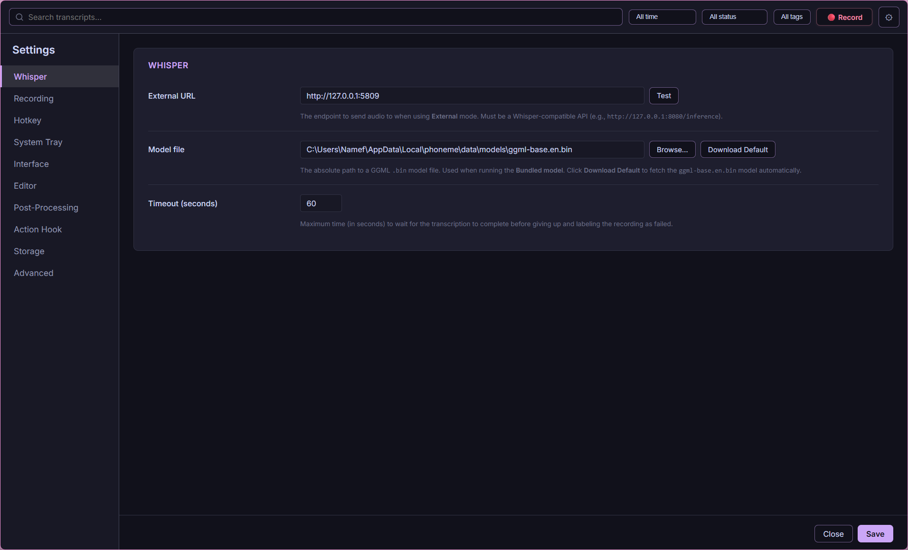
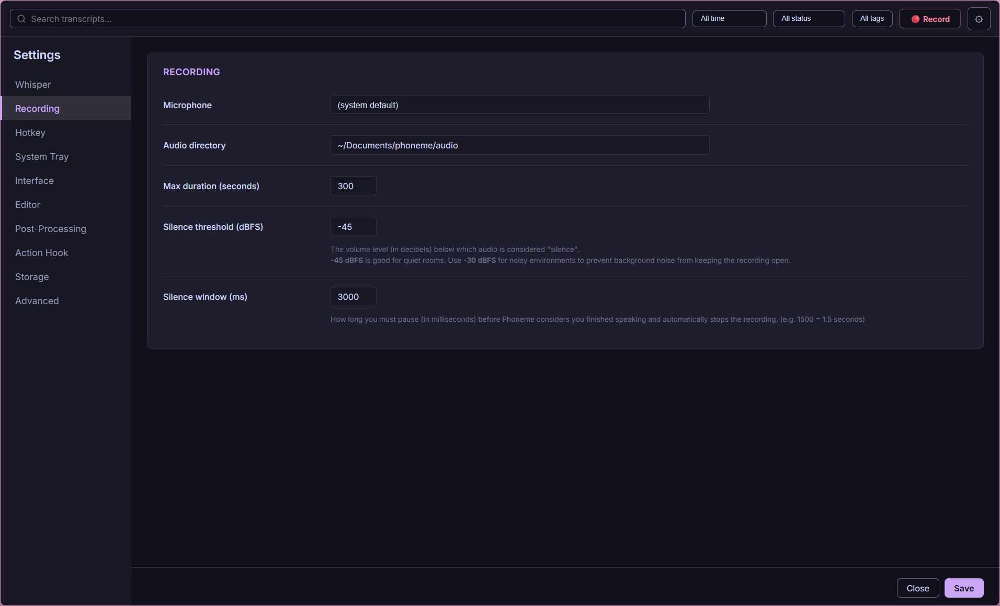
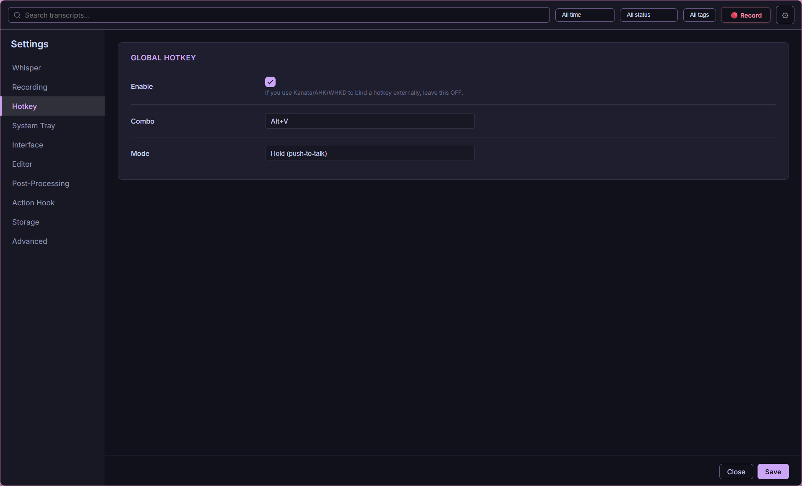
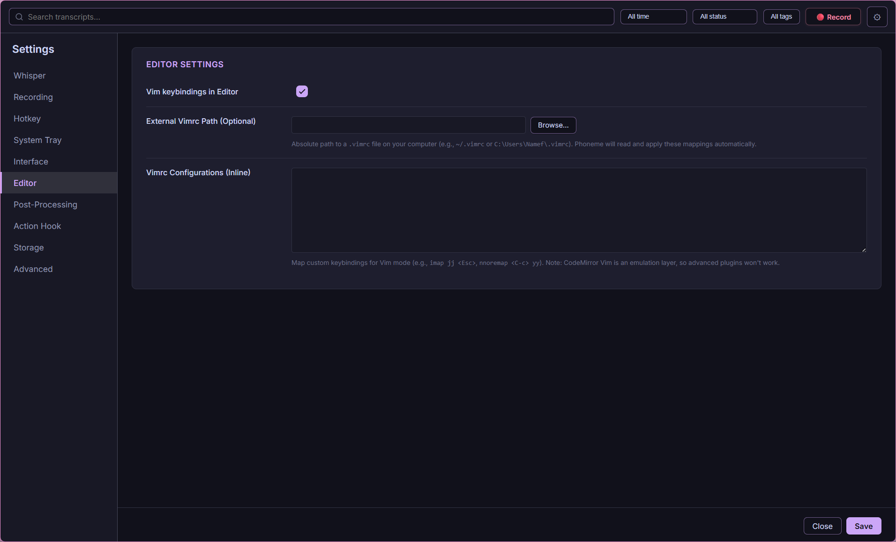
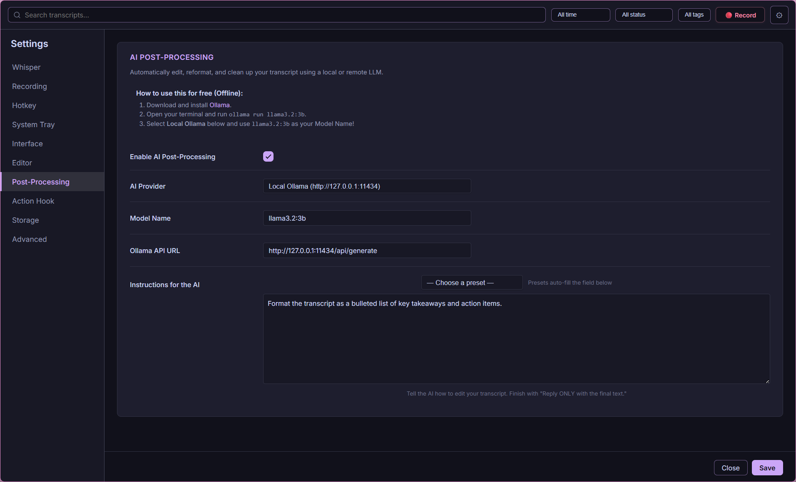
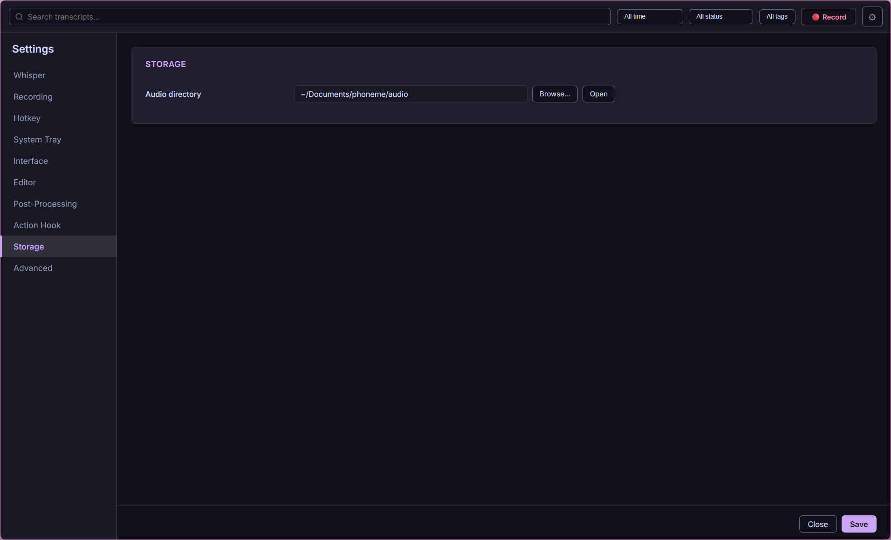
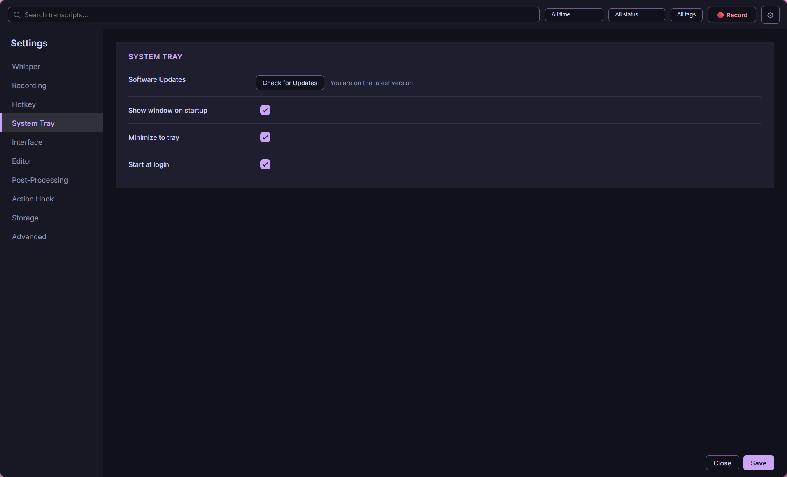
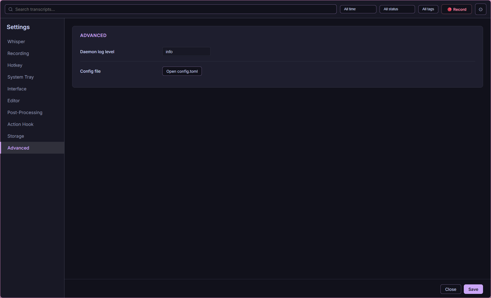

# Settings Overview

Phoneme stores all preferences in `%APPDATA%\phoneme\config.toml`. The Settings UI is a visual editor for that file. Changes apply after **Save**; the daemon hot-reloads on save.

Open Settings from the cog icon in the header or **Tray → Settings**.

The settings are grouped into six tabs in the left sidebar, with a **search box** at the top: start typing and Settings shows every matching field across all sections, with a live results count.

| Tab | Sections it contains |
|-----|----------------------|
| 🗣️ **Transcription** | Whisper / transcription provider, Live Preview, Diarization |
| 🎙️ **Capture** | Recording, Hotkeys |
| 🎨 **Appearance** | Interface, Editor |
| 🗂️ **Managers** | Tags · Profiles · Saved searches (sub-tabs) |
| ✨ **Post-Processing** | AI cleanup + Auto Summary, Hooks |
| ⚙️ **System** | Storage & retention, Tray, Semantic search, Advanced |

---

## 🗣️ Transcription



| Area | What it controls |
|------|------------------|
| **Provider** | Local whisper.cpp, OpenAI, Groq, Deepgram, AssemblyAI, ElevenLabs, or custom OpenAI-compatible endpoint |
| **Model manager** | Download GGML sizes (tiny → large-v3); hardware recommendation badge |
| **Language** | BCP-47 hint (`en`, `es`, …) or auto-detect |
| **Bundled server** | Port, model path, extra server args when running the local whisper-server |
| **Timeout** | How long to wait for transcription before giving up |

See [Providers & Models](providers_and_models.md) and [Whisper & Diarization](diarization_and_whisper.md).

### Live Preview

An independent transcription provider just for the live partial-transcript preview, so it never contends with the final transcription. Leave it unset to reuse the main provider, or point it at a small/fast local model on its own server or a fast cloud API (Groq, OpenAI, Deepgram). A **System-wide overlay** checkbox additionally floats the live caption in an always-on-top window over the whole desktop (requires Streaming preview). See [Live Preview & Pre-Roll](streaming_preview_and_preroll.md).

### Diarization

Speaker diarization backend: `none`, local ONNX, Deepgram, or AssemblyAI, plus the local model path. See [Whisper & Diarization](diarization_and_whisper.md).

## 🎙️ Capture



| Area | What it controls |
|------|------------------|
| **Audio directory** | Where `.wav` files are stored (default `~/Documents/phoneme/audio`) |
| **Input device / source** | Microphone selection (or `default`), and microphone vs. system-audio capture |
| **Auto-stop on silence** | Whether the Record button auto-stops on a quiet mic (off = manual start/stop toggle) |
| **Silence threshold / window** | dBFS level and duration for silence auto-stop |
| **Max duration** | Hard cap per recording (seconds) |
| **Pre-roll** | Milliseconds of idle mic buffer prepended on record start (anti-clip) |
| **Streaming preview** | Live partial transcript while recording (opt-in) |

### Hotkeys



Enable and configure global combos for record, transcribe-in-place, and meeting mode (each can be Hold or Toggle). See [Hotkeys & Recording Modes](hotkeys_and_recording_modes.md).

## 🎨 Appearance


Theme (Catppuccin Mocha default), 24-hour time, visible list columns (reorderable / toggleable), column widths, title-bar stripping, vim navigation, and **animation speed** for pane show/hide (Off / Fast / Normal / Slow — Off makes the sidebar, detail-pane, and focus-mode toggles instant).



Optional Vim keybindings (with inline or external `vimrc`) for the transcript editor.

## 🗂️ Managers

One home for the three managers, with sub-tabs on top:

- **Tags** — create, rename, recolor, delete, and merge tags (the quick
  Tag Manager popup is still on `Shift+T` / `g T`).
- **Profiles** — named full-config snapshots; save the current config and
  switch between setups (`g P` jumps here).
- **Saved searches** — the full saved-search manager: apply, rename, update to
  the current filters, delete (`g S` jumps here). See
  [Search & Organization](search_and_organization.md).

## 🏷️ Tags (legacy section)

Rename, recolor, and delete tags. See [Search & Organization](search_and_organization.md).

### Auto-Tagging

Under Post-Processing: let the AI **suggest tags** for each new transcript. It
prefers your existing tags and proposes new ones only when nothing fits; every
suggestion waits as a dashed ✨ chip on the recording until you approve or
dismiss it. Pick a provider/model (blank inherits the cleanup connection), cap
the number of suggestions, and tune the instructions. See
[Auto-Tagging](auto_tagging.md).

## ✨ Post-Processing



- **AI Post-Processing (cleanup):** LLM cleanup after Whisper, with one-click presets for many local and cloud providers, a live model picker, preset prompts, and a request timeout.
- **Auto AI Summary:** optional per-recording summary with its own provider/model/prompt (or inherit the cleanup connection).
- **Hooks:** scripts that run after transcription, optional webhook URL, keyword rules, and **Re-fire hook** behavior.

See [Smart Cleanup](smart_cleanup.md), [Providers & Models](providers_and_models.md), and [Plugins & Hooks](../developer-guide/plugins_and_hooks.md).

## ⚙️ System

### Storage & retention



Audio directory, auto-delete by age or count, optional audio-only deletion (keep searchable metadata), an **Import audio** button (bring a `.wav`/`.mp3`/`.m4a`/`.flac` into the pipeline), and export. See [Storage, Paths & Retention](storage_paths_and_retention.md) and [Importing Audio](importing_audio.md).

### Profiles

Switch named TOML profiles without hand-editing files. See [Config Profiles](config_profiles.md).

### System tray



Show window on startup, minimize to tray on close, start at Windows login.

### Advanced



Daemon log level, pipe name, re-run the First Run Wizard, and other power-user options.

### Semantic Search

Enable meaning-based search, set the embedding model directory and its knobs (max tokens, pooling, `token_type_ids`, query/passage prefixes), and **Re-embed all recordings** after a model change. See [Semantic Search](semantic_search.md).

> [!NOTE]
> This section currently has no dedicated sidebar tab — reach it by typing
> **"Semantic"** into the Settings search box.

## Manual editing

Power users can edit `config.toml` directly. After editing, tell the daemon to reload:

```powershell
phoneme config reload
```

Full schema: [Configuration Reference](../developer-guide/config_reference.md).

## 🩺 Health indicators

Phoneme watches its own health (the same checks as the Doctor) and surfaces
problems three ways:

- a **health pill** in the header — green dot when everything passes, blinking
  red with an issue count when something fails; click it to open the Doctor;
- the **⚙ Settings button pulses red** while anything is unhealthy;
- a **banner** appears under the header naming the failing checks, with
  **🔧 Fix now** (restarts the whisper-server(s) / starts the daemon) and
  **🩺 Open Doctor**. Dismissing it re-arms automatically once health returns
  to ok.

The Doctor covers config presence, the audio folder, **free disk space** on
the volumes holding your recordings and the app data (a warning under ~2 GB,
critical under ~500 MB), the hook command, **model-file integrity** (a
missing, 0-byte or truncated model download is flagged before it bites), and
the Whisper / live-preview / Ollama servers.

Each check shows a category badge when it fails — **Critical** (red: recording
or transcription is broken), **Warning** (amber: something is degraded but
capture still works) — plus a plain-English line on what the check verifies
and a `fix:` hint with the next step.

The Doctor itself can **restart the bundled whisper-server(s)** with one click
when the Whisper or live-preview probe fails — it sweeps hung or orphaned
server processes and respawns them from your config (CLI:
`phoneme doctor --fix`). When several checks fail at once, **🔧 Fix All** runs
every available fix top-down in one go and re-checks when done.
