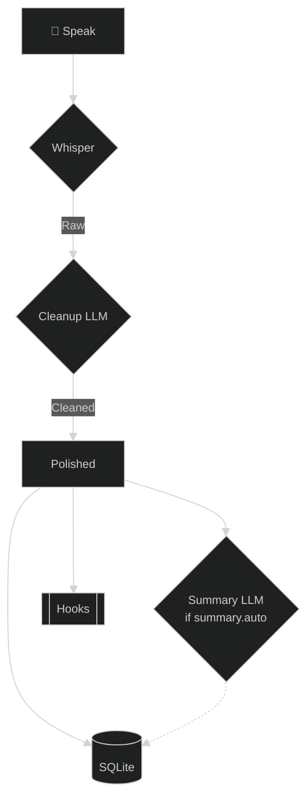

# ✨ Smart Cleanup (LLM Post-Processing)

Phoneme provides best-in-class transcription accuracy, but human speech is inherently messy. We stutter, we repeat ourselves, and we use filler words. 

**Smart Cleanup** solves this. Instead of just saving the raw Whisper transcription, Phoneme can automatically pipe your transcript through a Large Language Model (LLM) before saving it. This allows you to effortlessly remove dysfluency, fix phonetic misunderstandings, translate languages on-the-fly, or format your spoken thoughts into pristine bullet points.

## ⚙️ How it works

When Smart Cleanup is enabled, the pipeline intercepts your raw transcript right before it hits the database:

The raw output is always saved as `original_transcript`; the cleaned text becomes the live `transcript` and is also kept as `clean_transcript` (the pre-edit version). The summary, if generated, is saved to the `summary` column.

*(Note: Phoneme preserves both the raw machine transcript (`original_transcript`) and the cleaned-but-unedited transcript (`clean_transcript`) in the database. If the AI ever makes a mistake, you can **Restore raw transcript** or **Restore unedited transcript** from the detail view — see [the three transcript layers](getting_started.md#the-three-transcript-layers).)*

## 🧠 The AI-activity panel

Want to see exactly what each AI step asked for and got back? Toggle the
**AI-activity panel** — the floating brain button (the FAB at the edge of the
window) — with **`g A`**. It logs each AI step as it runs — transcription (shown
live), then the LLM steps: cleanup, summary, and auto-tag — recording both the
**prompt** sent and the **response** received (streamed live, token by token),
so you can see precisely how a transcript was shaped.

Each entry shows its stage, the recording it belongs to (a dot marks the one
you're viewing), and a timestamp; a pulsing 🧠 means a step is running right
now. The button is **drag-to-move** and the panel **resizes** — both remember
where you left them (**Ctrl+Shift+click** the button or the title bar to reset).
Re-runs are kept as **separate** entries rather than overwriting the original,
so you can compare attempts.

The log **persists across restarts** — recent sessions are reloaded when the
panel opens, so you can quit Phoneme and still review what each step did on
earlier recordings. The store keeps a generous rolling window of the most
recent sessions and prunes older ones automatically, so it never grows without
bound.

> [!TIP]
> The panel isn't a modal — close it with **`g A`** again, the ✕ button, or
> **Esc** while it's focused.

## 🧹 Filler removal (no AI)

Smart Cleanup uses an LLM. If all you want is the filler words gone — "um", "uh", "er" — you don't need one. Phoneme ships a **deterministic** filler-removal transform that runs in pure Rust: no provider, no network, instant, and the same input always gives the same output. It strips configured fillers at word boundaries and tidies the spacing/punctuation the removal leaves behind (no stray " ," or doubled spaces).

It's a Playbook step, off by default. Add the seeded **Remove fillers** entry (`filler_removal`) to a recipe — or wire it to a Custom Hotkey — and it rewrites the transcript like a cleanup step, just without the AI. Chain it before or after LLM cleanup as you like.

Tune it under `[filler]` in your config:

- **`words`** — the single fillers stripped, case-insensitively, at word boundaries (so "umbrella" survives). Defaults to a conservative set: `um`, `uh`, `er`, `ah`, `hmm`, `mhm`.
- **`phrases`** — multi-word fillers like "you know", "i mean", "sort of", "kind of", "like". These are **opt-in** because they double as real speech — "I *like* it", "*kind of* blue" — so they only apply when `aggressive` is on.
- **`aggressive`** — off by default (only `words` are stripped). Turn it on to also strip the `phrases` list, at the risk of removing a meaning-bearing "like".

See [config_reference → `[filler]`](../developer-guide/config_reference.md#filler) for the exact keys.

## ☁️ Provider Options

In keeping with Phoneme's philosophy, you have total control over *where* your data is processed. Configure cleanup under **Settings → Post-Processing → AI Post-Processing**.

Phoneme ships **one-click presets** for a long list of providers (Ollama, LM Studio, Jan, llama.cpp, OpenAI, Anthropic, Groq, Gemini, Mistral, DeepSeek, OpenRouter, Together, xAI, Cerebras, Fireworks, DeepInfra, Perplexity, Nebius, Hyperbolic). A preset sets the provider, endpoint, and a default model in one click — you just add a key (cloud only). For the full list and details, see [Providers & Models](providers_and_models.md).

### 🏠 Local AI (Free, Offline, Private)

For the ultimate privacy-respecting, local-first experience, run the LLM locally with Ollama (or LM Studio / Jan / any local OpenAI-compatible server).

1. Download and install [Ollama](https://ollama.com/).
2. Open your terminal and run: `ollama run llama3.2:3b` (a fast, capable 3B model).
3. In Phoneme's Settings → Post-Processing:
   - Check **Enable AI Post-Processing**
   - **Quick preset**: `Ollama (local)` (or pick **Local Ollama** as the provider)
   - **Model Name**: `llama3.2:3b`
   - **API Key**: leave blank.

The model field has a **Refresh** button that fetches your installed Ollama models.

#### Picking a cleanup model for your RAM

Cleanup runs *alongside* the local Whisper model, so the two share your memory
at the same time. On a tight machine, pick a small cleanup model so they fit
together:

| Your RAM | Suggested cleanup model | Roughly |
|----------|-------------------------|---------|
| **Tight (≤ 8 GB)** | `llama3.2:3b` or `phi3:mini` | ~2 GB — runs comfortably next to Whisper |
| **Comfortable (16 GB+)** | `llama3.1:8b` or larger | ~4 GB+ — better reasoning, more headroom needed |

> [!TIP]
> If cleanup feels slow or your machine starts swapping, drop to the ~2 GB tier
> first — a smaller model that finishes beats a larger one that stalls. The
> default `llama3.2:3b` is the safe starting point on most hardware.

You don't have to keep Ollama running yourself: when an AI step needs your
local Ollama and it isn't up, Phoneme launches `ollama serve` on demand and
stops it again when the engine shuts down (**Start Ollama automatically** in
Settings → Post-Processing, on by default). If Ollama was already running —
say it starts with Windows — Phoneme detects that and never touches it: no
restarts, no shutdowns, it stays entirely yours. Auto-launch only ever applies
to local (`127.0.0.1`/`localhost`) Ollama connections.

### 🌩️ Cloud Providers

If you don't have the hardware to run a local model, or want the best reasoning quality, plug in your own API key:

1. Pick a **Quick preset** (e.g. OpenAI, Anthropic, Groq, Gemini…) or set the **AI Provider** manually.
2. Enter the **Model Name** (the model field can fetch the live list via **Refresh**, or type any model).
3. Enter your **API Key**.

A **timeout** (`[llm_post_process].timeout_secs`, default 300) controls how long Phoneme waits for the cleanup LLM before falling back to the un-cleaned transcript.

> [!NOTE]
> **The timeout bounds idle time, not total generation.** A long transcript can
> legitimately take minutes to clean, so for streaming providers Phoneme measures
> *idle* time (how long the model goes without producing new output), not total
> generation time. As long as the model keeps emitting tokens, it is given all the
> time it needs — the timeout only fires on a genuine stall. The streaming path
> also floors the wait at **at least ~120 seconds**, so a local model that has to
> load into memory before its first token (slow right after a reboot) still gets
> room to start even if you set `timeout_secs` lower. When the timeout does fire,
> the message tells you what to do — *try a smaller model or raise
> `timeout_secs`*.

## 📝 Prompts & Presets

The magic of the LLM is in the prompt. You can select one of our default presets, or write your own to teach the AI exactly how you want your notes formatted.

<!-- SCREENSHOT PLACEHOLDER: Settings -> Post-Processing showing the prompt text area -->

> [!WARNING]
> You **must** instruct the AI to reply ONLY with the final text. Otherwise, the AI might add conversational filler like *"Here is your cleaned transcript:"* which will ruin your notes!

### Useful Prompt Ideas

> [!TIP]
> **The Dysfluency Fixer**
> I have a speech impediment that causes me to stutter and repeat sounds. Carefully clean up the transcript so it flows perfectly, removing any dysfluency while preserving my intended meaning. Reply ONLY with the cleaned text.

> [!TIP]
> **The Executive Assistant**
> Format this raw transcript into a clean, professional meeting note. Use bullet points or headings if appropriate. Output ONLY the formatted notes and absolutely no conversational filler.

> [!TIP]
> **The Universal Translator**
> Translate this transcript into perfect English. Keep the meaning exact and natural. Output ONLY the English translation and absolutely nothing else.

> [!TIP]
> **The Meeting Summarizer (Requires Meeting Mode)**
> This is a multi-speaker transcript. Provide a concise summary of the decisions made, and list the action items assigned to each speaker. Output ONLY the summary and action items.

## 🧾 Auto AI Summary

Separately from cleanup, Phoneme can produce a short **AI summary** of each recording.

- **On demand:** click **View summary** in any recording's detail view to generate (or regenerate) a summary.
- **Automatic:** enable **Summarize every recording** (`summary.auto`) under Settings → Post-Processing → Auto AI Summary, and a summary is generated as the **last step** of every recording's pipeline.

The summary **streams live** into the peek as it generates — you watch it write itself token by token (with a small spinner) rather than waiting on a "Generating summary…" placeholder, then it settles to the final stored text. The whole-meeting digest card streams the same way.

The summary uses its **own** provider, model, and prompt (`[summary]`). Leave the summary provider on **inherit** (blank) to reuse your cleanup connection, or pick a completely different provider+model — for example, clean up locally with Ollama but summarize with Claude. The stored summary lives in the `summary` column alongside the model that produced it (`summary_model`).

Built-in summary presets include bullet-point summary, 2–3 sentence summary, action items & decisions, a TL;DR paragraph, and meeting minutes.

## 🏷️ Auto titles

Timestamped names don't scan. Phoneme titles every recording automatically — the title shows as a bold first line in the recordings list and as the detail header.

- **Built-in heuristic (default, free, offline):** the first meaningful sentence of the transcript, with leading filler ("um", "okay so", …) stripped and the result cut at a word boundary around 60 characters.
- **AI titles (optional):** enable **Use the AI for titles** under Settings → Post-Processing → Auto Titles and the model writes a short (≤ 8 words) title instead. Like summaries, the title step inherits your cleanup connection unless you point it at its own provider/model (`[title]`). If the AI call fails for any reason, the heuristic title is used — a flaky provider never leaves recordings unnamed.

Click the title in a recording's detail header to edit it: **Enter** saves, **Esc** cancels, and saving an **empty** title clears it back to automatic. A title you typed yourself is never overwritten — re-transcribing refreshes automatic titles only.

## 🔁 Re-running cleanup & summary

You can re-process an existing recording without re-recording, using one-time overrides that are **never** saved to your config:

- **Re-transcribe** — re-runs transcription (optionally with a different model, and optionally skipping cleanup for that run).
- **Re-run cleanup** — re-runs only the LLM cleanup step against the preserved original transcript, optionally with a one-off provider / model / prompt / endpoint / key. Because it always starts from the raw original, it's idempotent — re-run it as many times as you like.
- **Regenerate summary** — re-runs the summary with an optional one-off model / prompt.

These live in each recording's **Re-run** menu. See [Providers & Models](providers_and_models.md#one-time-overrides-re-run-menu).

### Re-running through a different recipe

The **↻ Re-run** modal (the action button in a recording's detail row, and the bulk bar) opens with a **Recipe to run** picker at the top:

- **Default pipeline** *(default)* — re-runs the recording through whatever normal recordings run (your global cleanup → title → summary → tags → hooks chain).
- **Any other Playbook recipe** — re-runs the recording through that recipe's chain instead, so you can, say, push one note through a "Meeting minutes" recipe and another through a "Quick clean" recipe without touching your defaults. Build and edit chains in the **Playbook** settings section.

The per-step **model tabs** below the picker (Transcription / Post-processing / Title / Summary / Auto-tag) are **one-time overrides layered on top** of whichever recipe you choose — they don't replace the recipe, they tweak the models it uses for this run only. Nothing here is written to your config; the chosen recipe and models apply to that single re-run.

> [!NOTE]
> The **same modal** opened from the header — the **Quick Model Switcher** in its **Save as default** mode — is the unchanged global-model path: it persists your default models and has **no** recipe picker. Only the Re-run (Run once) mode chooses a recipe.
