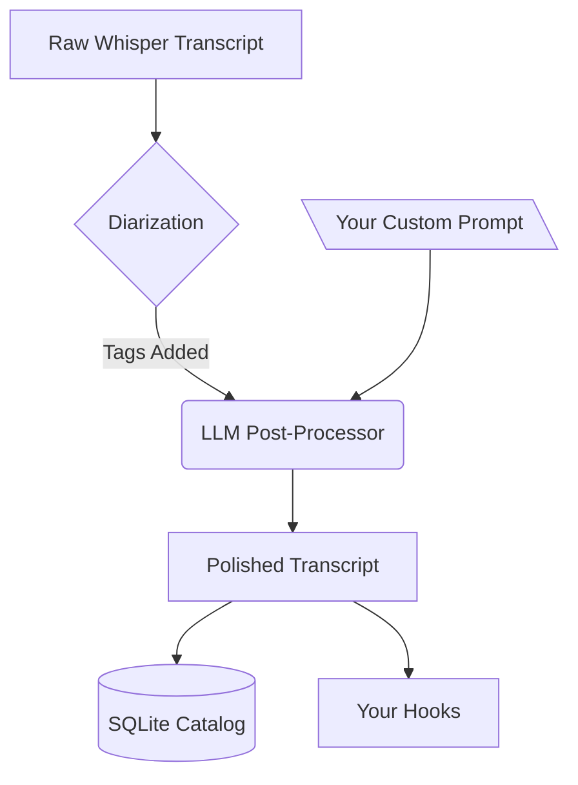

# Smart Cleanup (LLM Post-Processing)

Phoneme provides best-in-class transcription accuracy, but human speech is inherently messy. We stutter, we repeat ourselves, and we use filler words. 

**Smart Cleanup** solves this. Instead of just saving the raw Whisper transcription, Phoneme can automatically pipe your transcript through a Large Language Model (LLM) before saving it. This allows you to effortlessly remove dysfluency, fix phonetic misunderstandings, translate languages on-the-fly, or format your spoken thoughts into pristine bullet points.

## How it works

When Smart Cleanup is enabled, the pipeline looks like this:

1. You finish speaking.
2. Whisper transcribes the audio.
3. If Local Diarization is enabled (like in Meeting Mode), Phoneme identifies who is speaking and adds `[Speaker 1]: ` tags.
4. **The LLM takes the raw transcript, follows your exact Prompt instructions, and rewrites it.**
5. The finalized, pristine text is saved to your database and forwarded to your automation hooks.

*(Note: Phoneme always preserves the `original_transcript` in the database, so if the AI ever makes a mistake, your original words are perfectly safe).*

## Provider Options

In keeping with Phoneme's philosophy, you have total control over *where* your data is processed. You can configure this under **Settings → Smart Cleanup (AI)**.

<!-- SCREENSHOT PLACEHOLDER: Settings -> Smart Cleanup showing the provider dropdown -->

### Local AI (Free, Offline, Private)

For the ultimate privacy-respecting, local-first experience, you can run the LLM locally on your own hardware using Ollama.

1. Download and install [Ollama](https://ollama.com/).
2. Open your terminal and run: `ollama run llama3.2:3b`. This will download a highly capable, fast, 3-billion parameter model.
3. In Phoneme's Settings:
   - Check **Enable Smart Cleanup**
   - **AI Provider**: `Local Ollama`
   - **Model Name**: `llama3.2:3b`
   - **API Key**: Leave blank.

### Cloud Providers (OpenAI, Anthropic, Groq)

If you don't have the hardware to run Ollama smoothly, or want the absolute best reasoning capabilities (like Claude 3.5 Sonnet or GPT-4o), you can plug in your own API keys:

1. Select your **AI Provider** (`OpenAI`, `Anthropic`, `Groq`, or `Custom OpenAI-Compatible`).
2. Enter the Model Name (e.g., `gpt-4o`, `claude-3-5-sonnet-latest`, `llama-3.1-8b-instant`).
3. Enter your API Key.

## Prompts & Presets

The magic of the LLM is in the prompt. You can select one of our default presets, or write your own to teach the AI exactly how you want your notes formatted.

<!-- SCREENSHOT PLACEHOLDER: Settings -> Smart Cleanup showing the prompt text area -->

> [!WARNING]
> You **must** instruct the AI to reply ONLY with the final text. Otherwise, the AI might add conversational filler like *"Here is your cleaned transcript:"* which will ruin your notes!

### Useful Prompt Ideas

> [!TIP]
> **The Dysfluency Fixer**
> I have a speech impediment that causes me to stutter and repeat sounds. Carefully clean up the transcript so it flows perfectly, removing any dysfluency while preserving my intended meaning. Reply ONLY with the cleaned text.

> [!TIP]
> **The Executive Assistant**
> Format this raw transcript into a clean, professional meeting note. Use bullet points or headings if appropriate. Output ONLY the formatted notes and absolutely no conversational filler.

> [!TIP]
> **The Universal Translator**
> Translate this transcript into perfect English. Keep the meaning exact and natural. Output ONLY the English translation and absolutely nothing else.

> [!TIP]
> **The Meeting Summarizer (Requires Meeting Mode)**
> This is a multi-speaker transcript. Provide a concise summary of the decisions made, and list the action items assigned to each speaker. Output ONLY the summary and action items.

Enjoy perfectly polished transcripts!
